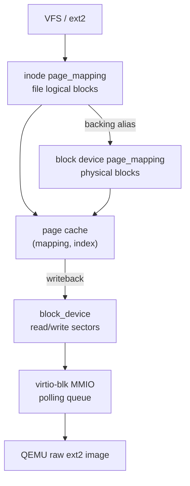
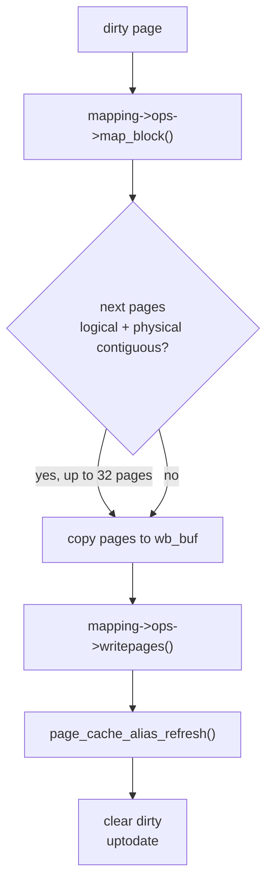
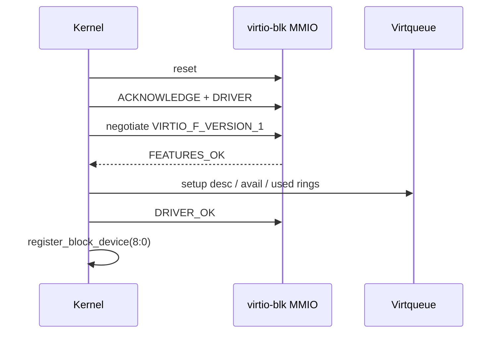

# 块设备与页缓存架构

块层连接文件系统和具体设备驱动。cuteOS 当前存储栈由块设备注册表、统一 4 KiB page cache、后台 writeback 和 virtio-blk MMIO 轮询驱动组成。

## 代码边界

主要文件：

- `include/kernel/blkdev.h`：块设备抽象。
- `block/blkdev.c`：块设备注册、查找、块设备 page_mapping。
- `include/kernel/page_mapping.h`：page cache 命名域和后端 ops。
- `include/kernel/page_cache.h`：page cache 公共 API。
- `block/page_cache.c`：缓存页生命周期、LRU、hash。
- `block/page_cache_dirty.c`：dirty list。
- `block/page_cache_writeback.c`：同步和聚合写回。
- `block/page_cache_alias.c`：inode mapping 与 raw block mapping 的别名一致性。
- `block/virtio_blk.c`：QEMU virtio-blk modern MMIO 驱动。

文件系统只能通过 block device/page cache 发起 I/O；驱动只实现扇区读写，不知道 VFS 或 ext2。

## 块设备抽象

`include/kernel/blkdev.h` 定义：



```c
struct block_device_operations {
    int (*read_sectors)(struct block_device *bdev, void *buf,
                        uint64_t sector, uint32_t nsec);
    int (*write_sectors)(struct block_device *bdev, const void *buf,
                         uint64_t sector, uint32_t nsec);
};

struct block_device {
    dev_t bd_dev;
    uint64_t bd_sectors;
    const struct block_device_operations *bd_ops;
    void *bd_private;
    struct page_mapping bd_pages;
};
```

单位：

- sector：512 字节。
- block/page cache page：4 KiB。
- `BLOCK_SECTORS = 8`。

注册 API：

```c
int register_block_device(struct block_device *bdev);
struct block_device *lookup_block_device(dev_t dev);
struct page_mapping *block_device_pages(dev_t dev);
```

设备表是固定数组 `dev_table[32]`，以 major number 为索引。virtio-blk 使用 major 8。

## 块设备 page_mapping

注册块设备时，`register_block_device()` 初始化 `bdev->bd_pages`：

```c
page_mapping_init(&bdev->bd_pages, bdev, &block_mapping_aops, NULL);
```

块设备 mapping 的 index 是 4 KiB 物理块号。其 ops：

- `readpage()`：把 block index 转换为 `index * BLOCK_SECTORS`，调用驱动读扇区。
- `map_block()`：逻辑块号就是物理块号。
- `writepages()`：写连续物理块。

ext2 metadata 通过 `page_cache_get_block(dev, block)` 使用这个 mapping。

## page_mapping 抽象

`page_mapping` 是 page cache 的命名域：

```c
struct page_mapping {
    void *host;
    const struct page_mapping_ops *ops;
    struct page_mapping *backing;
    struct list_head pages;
    struct list_head dirty_pages;
};
```

`page_mapping_ops`：

```c
struct page_mapping_ops {
    int (*readpage)(struct page_mapping *mapping,
                    uint64_t index, void *data);
    int (*map_block)(struct page_mapping *mapping,
                     uint64_t index, bool create,
                     uint32_t *block);
    int (*writepages)(struct page_mapping *mapping,
                      uint64_t start_index,
                      uint32_t nr_pages,
                      const void *data);
};
```

命名域区别：

| mapping | host | index 含义 |
| --- | --- | --- |
| inode `i_pages` | `struct inode` | 文件逻辑块号 |
| block device `bd_pages` | `struct block_device` | 磁盘物理块号 |

page cache 只看 `(mapping, index)`，不解释 ext2 块树。

## page_cache 对象

`struct page_cache` 包含：

- `owner`：所属 mapping。
- `index`：mapping 内索引。
- `data`：4 KiB 数据页。
- `refcount`
- `uptodate`
- `dirty`
- `writeback`
- `dropped`
- hash/LRU/mapping/dirty list 节点。

全局限制：

```c
#define PAGE_CACHE_HASH_BITS 7
#define PAGE_CACHE_NR_PAGES 512U
```

缓存 key 的 hash 混合 mapping 指针和 index，保证不同 inode 的逻辑块 0、块设备物理块 0 不冲突。

## page cache API

公共 API：

```c
struct page_cache *page_cache_get_page(struct page_mapping *mapping,
                                       uint64_t index,
                                       bool create,
                                       bool *created);
struct page_cache *page_cache_read_page(struct page_mapping *mapping,
                                        uint64_t index);
struct page_cache *page_cache_get_block(dev_t dev, uint64_t block);
struct page_cache *page_cache_grab_file_page(struct inode *inode,
                                             uint64_t index,
                                             bool create,
                                             bool *created);
void page_cache_put_page(struct page_cache *page);
uint8_t *page_cache_data(struct page_cache *page);
void page_cache_mark_dirty(struct page_cache *page);
int page_cache_sync_page(struct page_cache *page);
int page_cache_sync_mapping(struct page_mapping *mapping);
int page_cache_sync_inode(struct inode *inode);
int page_cache_sync_all(void);
void page_cache_truncate_mapping(struct page_mapping *mapping, uint64_t size);
void page_cache_invalidate_mapping(struct page_mapping *mapping);
```

`page_cache_get_page(create=true)` 只创建未 uptodate 的空页。需要有效内容时应使用 `page_cache_read_page()`，它会调用 mapping `readpage()`。

调用者拿到 page 后必须 `page_cache_put_page()`。

## LRU 与回收

page cache 满 512 页时：

1. 优先从 LRU 找 refcount 为 0、非 dirty、非 writeback 的 clean 页释放。
2. 如果没有 clean victim，找一个 dirty、未引用、非 writeback 页执行 `page_cache_wb_run()`。
3. 写回成功后再尝试回收 clean 页。

`dropped` 表示页面已经从所有可发现结构中移除，但仍被调用者引用。最后一次 put 才真正释放内存。

## dirty list

dirty 状态同时维护两个链表：

- 全局 `dirty_pages`：后台 writeback 使用。
- `mapping->dirty_pages`：fsync/msync/truncate 这类局部同步使用。

`page_cache_mark_dirty()` 也会把页面标记为 uptodate。dirty non-uptodate 页会导致未定义数据写回，因此被禁止。

## writeback

`page_cache_sync_page(page)` 同步单页：



1. 设置 `writeback=true`。
2. 调用 `mapping->ops->writepages(mapping, page->index, 1, page->data)`。
3. 成功后清 dirty，设置 uptodate。
4. 通过 `map_block()` 找到底层物理块，刷新 raw block alias。

`page_cache_wb_run(start)` 做保守聚合：

- 从同一 mapping 起始页开始。
- 收集逻辑 index 连续的 dirty 页。
- 要求 `map_block()` 得到的物理块也连续。
- 最多写入 32 页，受 `PAGE_CACHE_WB_ORDER=5` 分配的缓冲限制。
- 调用一次 `writepages()` 写连续范围。

后台线程 `page_cache_wb_thread()` 通过 `worker_run_periodic(5, ...)` 每 5 秒调用 `page_cache_sync_all()`。

## raw block alias 一致性

同一个磁盘块可能有两个缓存名字：

- ext2 inode mapping：文件/目录逻辑块，是权威副本。
- block device mapping：物理块 raw view，用于 metadata 或调试读取。

`page_mapping.backing` 表示上层 mapping 的底层 raw block 命名域。ext2 inode mapping 的 backing 指向对应 block device mapping。

`page_cache_alias_refresh(mapping, blocknr, data)` 在 inode 页写回成功后，如果 raw block alias 已经驻留，则更新其数据并清 dirty。

`page_cache_alias_invalidate(page)` 在上层 page drop 时，让 raw alias 变成 non-uptodate，下一次 raw 读取会重新从设备读。

这避免引入复杂反向索引，同时保证已驻留 raw alias 不长期陈旧。

## virtio-blk 驱动

`block/virtio_blk.c` 实现 QEMU virtio-blk MMIO modern 传输层，轮询模式。初始化状态机：



```text
reset
  -> ACKNOWLEDGE
  -> DRIVER
  -> feature negotiation: VIRTIO_F_VERSION_1
  -> FEATURES_OK
  -> setup queue 0
  -> DRIVER_OK
  -> register_block_device()
```

驱动只使用 request virtqueue，静态分配：

- descriptor table
- avail ring
- used ring
- request header/status
- block_device 实例

单次 I/O 使用 3 个描述符：

```text
request header -> data buffer -> status byte
```

读写 API 通过 block device operations 暴露：

```c
read_sectors(bdev, buf, sector, nsec)
write_sectors(bdev, buf, sector, nsec)
```

驱动要求 buffer 位于内核直接映射区，因为它通过 `__pa()` 把缓冲区地址交给设备。

## 轮询 I/O

`virtio_blk_rw()` 参数校验后：

1. 填 request header。
2. 填 3 个 descriptor。
3. 将 head descriptor 放入 avail ring。
4. memory barrier。
5. 更新 avail idx。
6. 写 `QUEUE_NOTIFY` kick 设备。
7. 自旋等待 used idx 到达 expected。
8. memory barrier。
9. 检查 status byte。

有自旋上限 `VBLK_POLL_SPIN_LIMIT`。超限会 panic，避免设备失速导致内核静默挂起。

当前同一时刻只有一个 in-flight 请求，因此静态 ring 和 request 结构足够。

## 初始化与 rootfs

`kernel_main()` 中：

```text
vfs_init()
filesystems_init()
virtio_blk_init()
vfs_mount_root(ROOT_DEV)
```

顺序要求：

- VFS 先准备文件系统注册和 cache。
- 内建文件系统注册为 filesystem type Adapter。
- virtio-blk 注册 major 8 block device。
- VFS rootfs probe 和选中文件系统的 mount 通过 `lookup_block_device()` 和
  page cache 读取 super block。

## 设计约束

- 文件系统不能直接调用 virtio MMIO，只能通过 block device operations。
- page cache key 必须始终是 `(mapping, index)`，不要退回全局 block number key。
- inode 数据页是文件/目录内容的权威副本；raw block cache 只是物理视图。
- dirty list 的全局和 per-mapping 链表必须同步维护。
- virtio-blk 当前是轮询单请求模型，引入中断或多请求队列需要重新设计同步和 buffer 生命周期。
