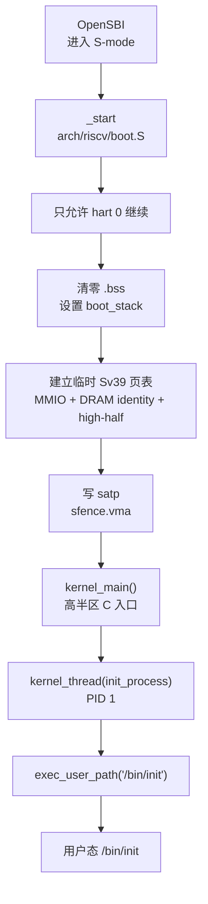
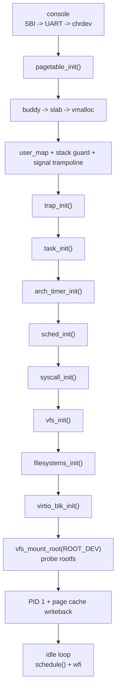

# 启动架构

本文描述 cuteOS 从 QEMU/OpenSBI 交给内核入口，到创建 PID 1 并进入调度循环的完整启动路径。启动代码的核心目标是：在最少假设下建立可执行的高半区内核地址空间，然后按依赖顺序初始化通用内核子系统。

## 启动入口

QEMU `virt` 平台通过 OpenSBI 将控制权交给内核 `_start`。入口位于 `arch/riscv/boot.S`，运行时仍处于 S 模式，MMU 关闭，地址访问使用物理地址。



`_start` 接收的第一个寄存器参数被当作 hart id 使用。当前实现只启动 hart 0，非 0 hart 进入永久 `wfi` 停泊循环。这个约束贯穿整个内核：调度、锁、futex、页缓存和设备 I/O 都按单核、非抢占内核假设设计。

早期汇编入口执行以下步骤：

1. 保存并检查 hart id，只允许 hart 0 继续。
2. 初始化 `gp`，让 RISC-V small data 访问可用。
3. 将 `sp` 设为 `boot_stack_top`，使用 4 KiB 启动栈。
4. 清零 `__bss_start` 到 `_end`，保证未初始化全局状态为零。
5. 构造临时 Sv39 根页表 `tmp_root`。
6. 写入 `satp` 启用 MMU，并执行 `sfence.vma`。
7. 跳转到高半区虚拟地址下的 `kernel_main()`。

## 临时页表

启动页表只使用 Sv39 根级别的 1 GiB mega page 映射，目的是让内核能够无缝从物理地址环境跳到链接地址环境。

临时映射包含三项：

| L2 项 | 虚拟范围用途 | 目标物理地址 | 权限 |
| --- | --- | --- | --- |
| `L2[0]` | 低地址 MMIO 设备窗口 | `0x00000000` 起 | `V/R/W/G` |
| `L2[2]` | DRAM 恒等映射 | `0x80000000` 起 | `V/R/W/X/G` |
| `L2[258]` | 内核高半区 DRAM 映射 | `0x80000000` 起 | `V/R/W/X/G` |

其中 `L2[258]` 对应 `KERNEL_VBASE + DRAM_BASE` 所在的 Sv39 根项。`kernel.ld` 将内核链接到：

- 物理加载基址：`BASE_ADDRESS = 0x80200000`
- 虚拟链接基址：`KERNEL_VBASE + BASE_ADDRESS`
- 高半区基址：`KERNEL_VBASE = 0xFFFFFFC000000000`

临时页表不承担长期权限隔离职责。正式权限和 4 KiB 页粒度映射由 `pagetable_init()` 重新建立。

## C 入口初始化顺序

`init/main.c` 的 `kernel_main()` 是通用内核入口。初始化顺序是架构设计的一部分，后续子系统依赖前置阶段提供的最小能力。



实际顺序如下：

1. `console_init_sbi()`：建立最早期 printk 输出。
2. `pagetable_init()`：创建正式内核页表并切换到它。
3. `console_init_mmio()`：切换到 UART MMIO 轮询控制台。
4. `console_chrdev_init()`：注册 `/dev/console` 字符设备。
5. `buddy_init()`：初始化物理页伙伴分配器。
6. `pagetable_use_buddy()`：让后续页表页从 buddy 分配。
7. `slab_init()`：启用 `kmalloc()`/`kfree()`。
8. `vmalloc_init()`：启用内核虚拟连续映射分配。
9. `user_map_init()`：初始化用户页表特殊映射注册表。
10. `user_map_reserve("stack_guard", USER_STACK_GUARD_BASE, USER_STACK_BASE)`：保留用户栈保护区。
11. `signal_user_map_init()`：注册信号 trampoline 用户映射。
12. `trap_init()`：安装 trap 向量并打开 S 态定时器中断。
13. `task_init()`：创建 idle task 和 CPU-local 当前任务状态。
14. `arch_timer_init()`：设置第一次 Sstc timer 比较值。
15. `sched_init()`：初始化 MLFQ runqueue。
16. `syscall_init()`：安装 syscall 表，并初始化 futex 桶。
17. `vfs_init()`：初始化 inode cache、dentry cache 和文件系统注册表。
18. `filesystems_init()`：注册编译进内核的文件系统类型。
19. `virtio_blk_init()`：初始化 QEMU virtio-blk MMIO 设备并注册块设备。
20. `vfs_mount_root(ROOT_DEV)`：对 root block device 探测已注册文件系统类型，
    挂载唯一匹配的根文件系统。
21. 可选 `kernel_test()`：在测试配置下运行内核自测。
22. `kernel_thread(init_process, NULL)`：创建 PID 1 内核线程。
23. `set_init_task(init)`：记录 PID 1，供 exit/reparent 路径使用。
24. `kernel_thread(page_cache_wb_thread, NULL)`：创建页缓存后台写回线程。
25. idle 循环反复调用 `schedule()` 和 `wait_for_interrupt()`。

这个顺序体现了几个关键依赖：

- 正式页表必须早于 buddy，因为 buddy 需要知道 early boot allocator 的结束位置。
- slab 必须晚于 buddy，因为小对象缓存从 buddy 取页。
- task 必须晚于 trap，因为任务首次切入依赖 `__trapret` 和 trap frame 布局。
- syscall 必须晚于 sched/task，因为 syscall 处理会访问当前任务、地址空间和等待队列。
- 文件系统注册必须晚于 VFS 初始化。
- rootfs 挂载必须晚于 virtio-blk 注册，因为文件系统 probe 和 mount 都通过
  block device/page cache 发起 I/O。根挂载失败会立即 panic，因为 PID 1 依赖
  `/bin/init` 可从根文件系统访问。

## 正式内核地址空间

`pagetable_init()` 位于 `arch/riscv/mm/page_table.c`，它用 early bump allocator 从 `_end` 之后分配页表页，并创建正式内核页表。

正式页表使用 4 KiB 页映射整个 DRAM 的高半区：

```text
KERNEL_VBASE + DRAM_BASE ... KERNEL_VBASE + DRAM_BASE + DRAM_SIZE
    -> DRAM_BASE ... DRAM_BASE + DRAM_SIZE
```

同时，正式页表将 `DRAM_BASE` 所在恒等映射根项指向同一组下级页表。这样从临时页表切换到正式页表时，当前执行地址和高半区地址都仍然有效。

低 1 GiB 的 MMIO 空间通过根级 mega page 保留为 `R/W/G`，不可执行。

## 从内核线程到 PID 1

`kernel_thread()` 创建的任务不是立即在 C 调用栈中执行。它在新任务的内核栈顶部构造一个 `trap_frame`，并设置：

- `sepc = fn`
- `a0 = arg`
- `sstatus = SSTATUS_SPP | SSTATUS_SPIE`
- `ctx.ra = __trapret`
- `ctx.sp = trap_frame`

调度器第一次切入该任务时，`switch_to()` 恢复 `ctx.ra/sp`，随后跳入 `__trapret`，由 `sret` 进入内核线程入口函数。

PID 1 的入口是 `kernel/init_process.c` 中的 `init_process()`。它调用：

```c
exec_user_path("/bin/init");
```

`exec_user_path()` 从 VFS 打开 `/bin/init`，加载静态 RISC-V ELF，替换当前任务的 `mm/satp/trap_frame`，最后通过 trap return 进入用户态。

## 启动后的常驻内核线程

启动结束后至少存在以下任务：

| 任务 | 来源 | 角色 |
| --- | --- | --- |
| PID 0 idle | `task_init()` 静态初始化 | 无 runnable task 时运行，执行 `wfi` |
| PID 1 init | `kernel_thread(init_process)` | 通过 exec 切换到 `/bin/init` |
| page cache writeback | `kernel_thread(page_cache_wb_thread)` | 周期性同步全局脏页 |

idle task 使用启动栈，不走普通 `task_alloc()` 的内核栈分配路径。其他任务拥有 8 KiB 内核栈，并在栈底放置 canary。

## 启动边界

启动路径不解析 DTB。DRAM 大小、QEMU CPU 数、rootfs 镜像大小和调试选项来自 Kconfig；UART、virtio MMIO 等设备地址由对应驱动常量决定。

启动代码只建立内核运行的最小闭环：

```text
OpenSBI
  -> boot.S 临时地址空间
  -> kernel_main 子系统初始化
  -> virtio-blk + VFS rootfs probe/mount
  -> PID 1 exec /bin/init
  -> trap/syscall/sched 驱动用户态运行
```

新增启动阶段代码时，应保持这个边界：架构层负责 CPU/MMU/trap 的最低级状态，通用初始化负责按依赖装配子系统，具体策略不得塞回 `boot.S`。
