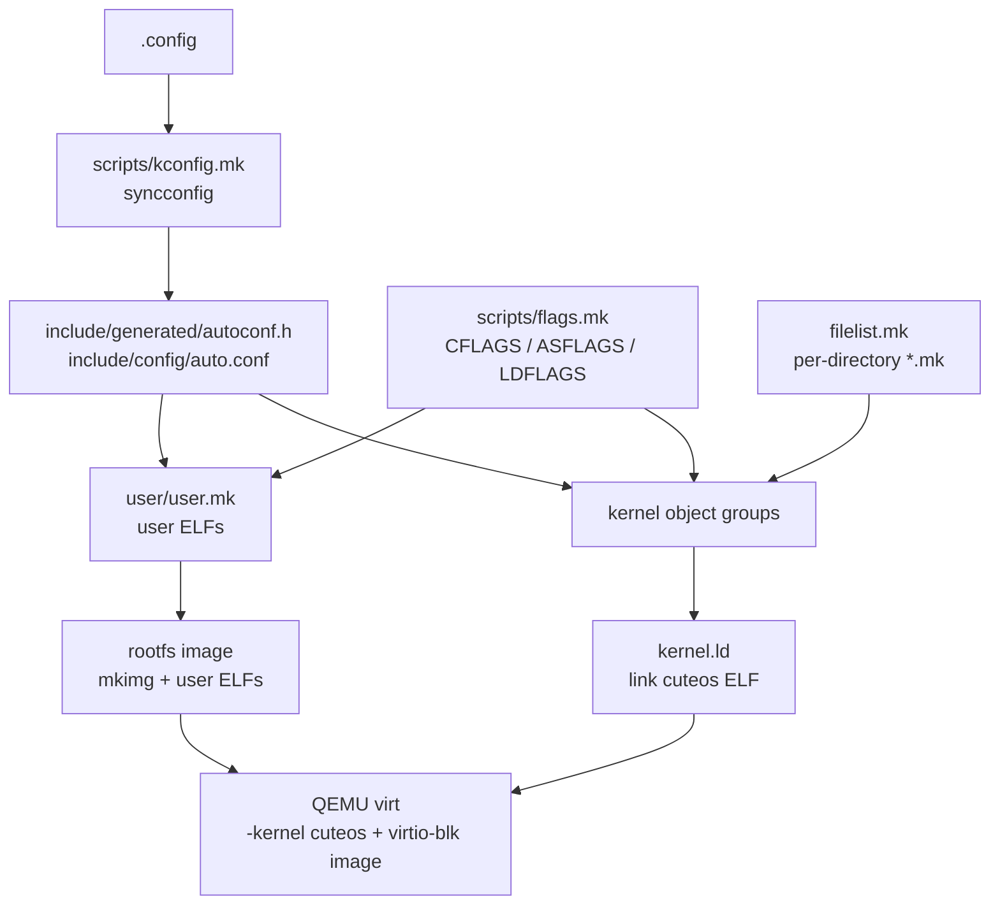
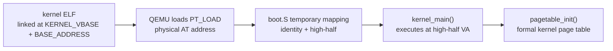

# 构建与链接架构

本文描述 cuteOS 构建系统如何组织内核对象、用户程序、链接脚本、Kconfig 和 QEMU 镜像。构建系统的架构目标是让每个目录拥有自己的对象列表，同时由顶层 `Makefile` 统一聚合、链接和运行。

## 顶层 Makefile 结构

顶层 `Makefile` 先引入构建基础设施：



```make
include scripts/toolchain.mk
include scripts/kconfig.mk
include scripts/build.mk
include scripts/flags.mk
include filelist.mk
```

其中：

- `scripts/toolchain.mk` 选择 RISC-V 交叉工具链、QEMU 和工具路径。
- `scripts/kconfig.mk` 负责 `.config`、`include/config/auto.conf`、`include/generated/autoconf.h`。
- `scripts/build.mk` 提供静默构建输出等通用构建规则辅助。
- `scripts/flags.mk` 定义内核 C/ASM/LDFLAGS。
- `filelist.mk` 引入各目录对象清单。

`filelist.mk` 是内核对象分组的入口：

```make
include arch/riscv/arch.mk
include init/init.mk
include kernel/kernel.mk
include sched/sched.mk
include mm/mm.mk
include fs/fs.mk
include block/block.mk
include drivers/drivers.mk
include syscall/syscall.mk
include lib/lib.mk
```

顶层再将各组对象聚合为 `OBJ_REL`：

```text
ARCH_OBJS
INIT_OBJS
KERNEL_OBJS
MM_OBJS
FS_OBJS
BLOCK_OBJS
DRIVER_OBJS
SCHED_OBJS
SYSCALL_OBJS
KERNEL_TEST_OBJS
LIB_OBJS
```

普通构建中 `KERNEL_TEST_OBJS` 为空。`make test` 递归执行
`KERNEL_SELFTEST=1 OUTROOT=build/test` 构建，此时顶层 `Makefile` 包含
`test/test.mk`，递归发现 `test/<subsystem>/*_test.c` 并填充
`KERNEL_TEST_OBJS`。测试执行顺序由 `test/test.c` 的显式 registry 决定，不依赖
链接顺序。

`KERNEL_SELFTEST` 同时进入 CFLAGS 和 ASFLAGS。除链接测试对象外，它还让
`init/main.c` 创建 self-test 内核线程，而不是创建 PID 1。普通构建和测试构建
都使用 8 KiB 启动栈；深层回归路径运行在 self-test 线程的普通 task 栈上。
`make test` 会强制重建测试 rootfs，运行脚本再复制临时镜像交给 QEMU，避免
自测写入污染后续运行。

新增生产源文件时必须更新所属目录的 `.mk` 文件，否则不会进入内核链接。新增
内核自测文件时放入 `test/<subsystem>/`，由 `test/test.mk` 自动发现。

## 编译标志

内核编译参数由 `scripts/flags.mk` 定义。核心约束包括：

- 架构：`-march=rv64gc -mabi=lp64 -mcmodel=medany`
- 标准：`-std=gnu17`
- freestanding：`-ffreestanding -fno-common -nostdlib -nostdinc`
- 非 PIE：`-fno-pie -no-pie`
- include 路径：`include` 和 `arch/riscv/include`
- 全局预包含：`include/generated/autoconf.h`、`include/kernel/compiler.h`

优化等级、调试信息、frame pointer、LTO、UBSAN、section GC 都由 Kconfig 控制。

`CONFIG_LTO=y` 时，内核链接器从 `ld` 切换为 `$(CC)`，并通过 `-Wl,-T,kernel.ld` 使用同一个链接脚本。`lib/string.o` 和 `lib/softfloat.o` 被列为 `KERNEL_NO_LTO_OBJS`，在 LTO 构建中排除 LTO 编译标志。

## 内核链接布局

内核链接脚本是顶层 `kernel.ld`。关键常量为：



```ld
BASE_ADDRESS = 0x80200000;
KERNEL_VBASE = 0xFFFFFFC000000000;
. = KERNEL_VBASE + BASE_ADDRESS;
```

这意味着：

- 内核 ELF 的链接地址在高半区。
- 物理加载地址以 `AT(ADDR(section) - KERNEL_VBASE)` 表示。
- QEMU `-kernel` 将 ELF 加载到物理内存后，`boot.S` 负责启用高半区映射并跳转。

链接脚本生成四类 PT_LOAD：

| 段 | 权限 | 内容 |
| --- | --- | --- |
| `text` | `R/X` | `.text.entry`、`.text*` |
| `rodata` | `R` | `.rodata*` |
| `data` | `R/W` | `.data*`、`.sdata*`、`__global_pointer$` |
| `bss` | `R/W` | `.sbss*`、`.bss*`、COMMON |

段边界按 4 KiB 对齐，`_end` 作为 early allocator 的起点参考。

## 架构对象

`arch/riscv/arch.mk` 当前包含：

```text
arch/riscv/boot.o
arch/riscv/entry.o
arch/riscv/switch.o
arch/riscv/trap.o
arch/riscv/task.o
arch/riscv/trap_init.o
arch/riscv/timer.o
arch/riscv/plic.o
arch/riscv/sbi.o
arch/riscv/mm/page_table.o
arch/riscv/mm/user_map.o
arch/riscv/mm/tlb.o
```

这些对象拥有 CPU、页表、CSR、trap frame 和上下文切换语义。通用子系统不应直接复制这些低级细节，而应通过 `include/kernel/*` 或 `arch/riscv/include/arch/*` 的 facade 调用。

## Kconfig 生成物

`scripts/kconfig.mk` 以 `Kconfig` 和架构/子系统 Kconfig 文件生成：

- `.config`
- `include/config/auto.conf`
- `include/config/auto.conf.cmd`
- `include/generated/autoconf.h`

内核和用户态编译都预包含 `include/generated/autoconf.h`。因此构建配置可以影响内核对象和用户测试程序。

`KCONFIG_SKIP_GOALS` 让 `clean`、`help`、`format`、`defconfig` 等目标不强制要求已有配置。

## 用户态构建

用户程序构建由 `user/user.mk` 管理，并在顶层 `Makefile` 中引入。用户态工具链也使用 riscv64 gcc/ld，但编译参数独立于内核：

- `-march=rv64gc -mabi=lp64 -mcmodel=medany`
- `-ffreestanding -nostdlib -nostdinc -fno-builtin`
- include：`user/libc/minimal/include` 和 `include`
- 链接脚本：`user/user.ld`

用户 ELF 列表包括：

- `USER_INIT_ELF = build/.../user/init/init.elf`
- `USER_SH_ELF = build/.../user/init/sh.elf`
- `user/bin/*.c` 生成的 `bin/*.elf`
- 最小 libc 对象
- `user/start.o`

`user/user.ld` 将用户程序基址设为 `0x10000`，并拆分页对齐的 RX、R、RW PT_LOAD：

```text
.text   -> PF_R | PF_X
.rodata -> PF_R
.data/.bss -> PF_R | PF_W
```

内核 exec loader 按用户 ELF 的 PT_LOAD 权限映射用户页。用户链接脚本的分段设计避免 text/data 被合并成单个 RWE 段。

## 内核产物

默认目标 `all` 构建 `$(OUTDIR)/cuteos`。链接后生成两个辅助文件：

- `cuteos.asm`：`objdump -S` 反汇编。
- `cuteos.sym`：符号表精简输出。

`CONFIG_KSYMS=y` 时构建分两阶段：

1. 链接 `cuteos.stage1`。
2. 用 `scripts/gen_ksyms.sh` 从 stage1 符号表生成 `kernel/ksyms.generated.c`。
3. 将生成对象纳入最终链接。

## 根文件系统镜像

`$(KERNEL_IMG)` 由 `$(MKIMG)` 生成，输入是用户 ELF：

```make
MKIMG_SIZE_MB=$(CONFIG_ROOTFS_IMAGE_SIZE_MB) $(MKIMG) \
    $@ $(USER_INIT_ELF) $(USER_SH_ELF) ...
```

QEMU 启动时使用：

```text
-drive file=$(KERNEL_IMG),if=none,format=raw,id=x0
-device virtio-blk-device,drive=x0,bus=virtio-mmio-bus.0
```

内核侧 `virtio_blk_init()` 将该设备注册为 major 8 minor 0。启动路径调用
`vfs_mount_root(ROOT_DEV)` 对该块设备探测已注册文件系统类型；当前构建脚本
生成的镜像为 ext2，因此会命中 ext2 Adapter 并挂载为 `/`。

## QEMU 启动参数

顶层 `Makefile` 的 QEMU 参数体现当前平台假设：

```text
-machine virt
-kernel build/.../cuteos
-m $(CONFIG_DRAM_SIZE_MB)M
-smp $(CONFIG_QEMU_CPUS)
-nographic
-global virtio-mmio.force-legacy=false
```

`virtio-mmio.force-legacy=false` 与 `block/virtio_blk.c` 的 modern virtio 1.x 初始化路径一致。驱动只协商 `VIRTIO_F_VERSION_1`。

## 构建边界

构建系统的所有权边界如下：

- 顶层 `Makefile` 负责聚合和最终产物。
- 每个源码目录负责声明自己的对象列表。
- `scripts/flags.mk` 负责全局编译/链接约束。
- `kernel.ld` 和 `user/user.ld` 分别定义内核与用户 ABI 布局。
- Kconfig 只通过生成头和 `auto.conf` 影响编译，不应在源码中硬编码可配置项的替代路径。

新增模块时，应同时考虑：对象清单、头文件边界、Kconfig 选项、链接布局和是否需要用户态测试程序。
