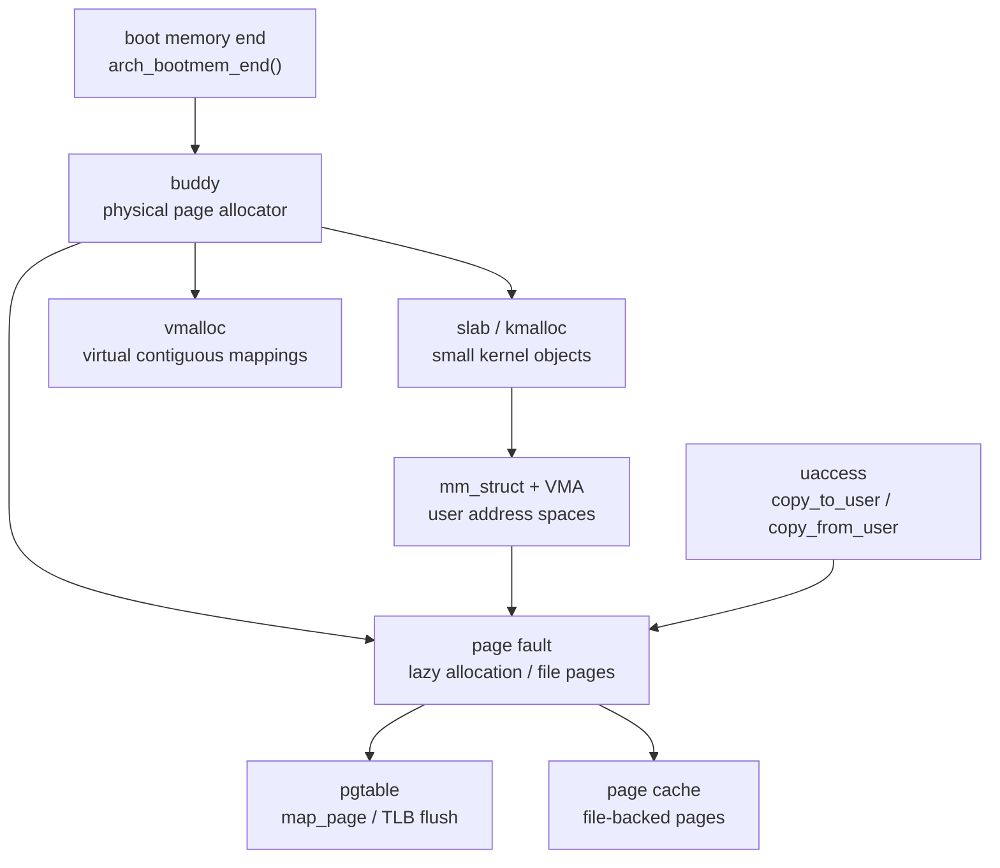
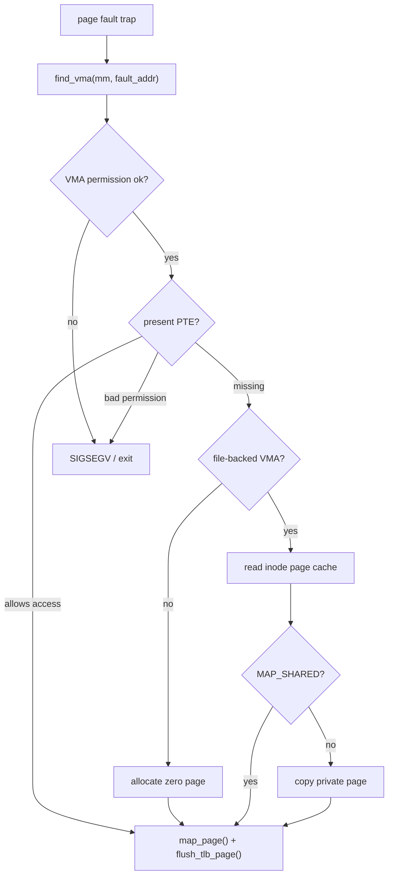

# 内存管理架构

内存管理由三层组成：物理页分配、内核对象/虚拟映射分配、用户地址空间和缺页处理。页表的架构细节见 `pgtable.md`，本文关注通用 mm 子系统和对外 API。

## 子系统边界

主要文件：



- `mm/buddy.c`：物理页伙伴分配器。
- `mm/slab.c`：小对象 `kmalloc()` 分配器。
- `mm/vmalloc.c`：内核虚拟连续映射。
- `mm/mmap.c`：用户 `mm_struct`、VMA、mmap/brk/munmap/mprotect/mremap/msync。
- `mm/page_fault.c`：用户/内核态缺页处理。
- `mm/uaccess.c`：用户指针范围检查和复制。
- `mm/user_map.c`：每个用户页表必须包含的特殊映射注册表。
- `mm/internal.h`：mm 内部数据结构与 helper。
- `include/kernel/mm.h`：对外 mm API。
- `include/kernel/user_map.h`：特殊用户映射 API。

设计边界：

- `mm/internal.h` 只给 `mm/` 内部使用。
- syscall 层只能调用 `include/kernel/mm.h` 暴露的函数。
- 架构页表操作通过 `include/kernel/pgtable.h`/`arch/pgtable.h` 完成。
- 文件页由 VFS inode 的 `page_mapping` 管理，mm 不解释 ext2 块布局。

## 物理页分配：buddy

`buddy_init()` 在 `pagetable_init()` 之后运行。它通过 `bootmem_end()` 获取 early allocator 的结束位置，并把可用 DRAM 建成伙伴空闲链表。

物理内存布局：

```text
DRAM_BASE
  内核镜像、早期页表、early allocator 已用页
arch_bootmem_end()
  mem_map[] 页面描述符数组
ALIGN_UP(mem_map end, PAGE_SIZE)
  buddy 可分配页
DRAM_BASE + DRAM_SIZE
```

`mem_map` 覆盖整个 DRAM，每个物理页有一个 `struct page`。最大阶数 `MAX_ORDER=9`，最大连续块为 2 MiB。

公开 API 位于 `include/kernel/buddy.h`：

```c
void buddy_init(void);
void *get_free_page(uint32_t order);
void free_page(void *addr, uint32_t order);
struct page *virt_to_page(const void *addr);
void *bootmem_end(void);
```

`get_free_page(order)` 返回直接映射区内核虚拟地址。`free_page()` 会检查：

- 地址非空且页对齐。
- 地址属于 DRAM 直接映射范围。
- order 与分配时一致。
- 不是 double free。
- 不是 reserved 页。
- 不是 slab 页。

这些检查让底层分配错误尽早 panic，而不是静默破坏 free list。

## 小对象分配：slab/kmalloc

`slab_init()` 在 buddy 之后运行。slab 提供 8 个固定 size class：

```text
16, 32, 64, 128, 256, 512, 1024, 2048
```

`kmalloc(size)` 选择第一个可容纳请求大小的 cache。cache 空时，从 buddy 分配 1 页并切成 slot。每个 slot 前有 `kmalloc_header`，用于 `kfree()` 判断对象来源和 double free。

大于 2048 字节的请求走 large allocation：按页阶从 buddy 分配，header 记录 order。

公开 API 位于 `include/kernel/slab.h`：

```c
void slab_init(void);
void *kmalloc(size_t size);
void kfree(void *ptr);
```

slab 页会在 `struct page` 上设置 `PG_SLAB`，因此不能通过 `free_page()` 直接释放。

## vmalloc

`vmalloc_init()` 建立内核虚拟连续、物理可不连续的分配区域。它用于需要较大连续虚拟空间但不要求连续物理页的数据，例如 ext2 block group descriptor table。

公开 API 位于 `include/kernel/vmalloc.h`：

```c
void vmalloc_init(void);
void *vmalloc(size_t size);
void vfree(void *addr);
```

vmalloc 的实现依赖内核页表动态映射，因此必须晚于 `pagetable_use_buddy()` 和 buddy 初始化。

## 用户地址空间模型

`struct mm_struct` 定义在 `mm/internal.h`，对外不透明。核心字段：

```c
struct mm_struct {
    refcount_t refcount;
    mutex_t mmap_lock;
    pte_t *pgd;
    uintptr_t brk;
    uintptr_t code_start;
    uintptr_t code_end;
    uint32_t membarrier_registrations;
    struct vm_area_struct vma[NR_VMA];
};
```

VMA 使用固定数组：

```c
#define NR_VMA 16
```

每个 `vm_area_struct` 描述一段连续虚拟区域：

- `vm_start/vm_end`
- `vm_flags`：`VM_READ/VM_WRITE/VM_EXEC`
- `vm_type`：`VMA_CODE/VMA_HEAP/VMA_STACK/VMA_MMAP`
- `vm_file` 和 `vm_offset`
- `vm_shared`
- `used`

固定数组让遍历和内存管理简单，但 mmap、munmap、mprotect、mremap 必须在分裂 VMA 前检查剩余槽位。

## mm 生命周期 API

对外 API 位于 `include/kernel/mm.h`：

```c
struct mm_struct *mm_create_user(void);
void mm_get(struct mm_struct *mm);
void mm_put(struct mm_struct *mm);
struct mm_struct *dup_mm(struct mm_struct *oldmm);
uintptr_t mm_user_satp(const struct mm_struct *mm);
```

`mm_create_user()` 分配 `mm_struct` 和用户 PGD。用户 PGD 会复制内核高半区映射并应用 `user_map` 特殊映射。

`dup_mm()` 用于 fork-like clone。它复制 mm 元数据、VMA 数组和已驻留用户页；未驻留 lazy 页面保持未映射。file-backed shared 映射不复制物理页，而共享 inode page cache。

`mm_put()` 通过引用计数释放地址空间。销毁时会：

- unmap 用户范围。
- 释放用户物理页。
- 释放用户页表低半区页表页。
- 保留共享的内核高半区页表项不释放。

## exec 映射 API

exec loader 使用以下 API 建立新进程地址空间：

```c
int mm_map_page(struct mm_struct *mm, uintptr_t va, void *page, int prot);
int mm_map_segment(struct mm_struct *mm, uintptr_t start,
                   uintptr_t end, int prot);
int mm_map_file_segment(struct mm_struct *mm, struct file *file,
                        uintptr_t start, uintptr_t end, int prot,
                        uint64_t file_offset);
int mm_add_stack(struct mm_struct *mm, void *stack_page);
int mm_finalize(struct mm_struct *mm, uintptr_t first_vaddr,
                uintptr_t last_end);
```

`kernel/exec.c` 读取 ELF PT_LOAD，按 segment 权限转换为 Linux `PROT_*`，并通过这些 API 创建代码、数据、BSS 和用户栈映射。

## mmap/brk 系列 API

系统调用层调用：

```c
uintptr_t mm_brk(struct mm_struct *mm, uintptr_t addr);
ssize_t mm_mmap(struct mm_struct *mm, uintptr_t addr,
                size_t length, int prot, int flags);
ssize_t mm_mmap_file(struct mm_struct *mm, uintptr_t addr,
                     size_t length, int prot, int flags,
                     int fd, uint64_t offset);
int mm_munmap(struct mm_struct *mm, uintptr_t addr, size_t length);
int mm_mprotect(struct mm_struct *mm, uintptr_t addr, size_t len, int prot);
ssize_t mm_mremap(struct mm_struct *mm, uintptr_t old_addr,
                  size_t old_size, size_t new_size, int flags,
                  uintptr_t new_addr);
int mm_msync(struct mm_struct *mm, uintptr_t addr, size_t len, int flags);
int mm_madvise(struct mm_struct *mm, uintptr_t addr, size_t len, int advice);
int mm_mlock(struct mm_struct *mm, uintptr_t addr, size_t len);
int mm_munlock(struct mm_struct *mm, uintptr_t addr, size_t len);
```

`mm_brk()` 当前不允许缩小堆，只更新 VMA 和 `brk`，物理页由缺页 lazy allocation 分配。

`mm_mmap_file()` 支持匿名和 file-backed 映射，检查：

- `MAP_SHARED/MAP_PRIVATE` 必须二选一。
- `MAP_FIXED` 地址必须非零且页对齐。
- `MAP_FIXED_NOREPLACE` 使用精确地址但不替换已有 VMA；冲突返回
  `-EEXIST`。
- `MAP_DENYWRITE`、`MAP_EXECUTABLE`、`MAP_NORESERVE`、`MAP_STACK` 作为
  Linux 兼容 hint 接受为 no-op。
- `MAP_SHARED_VALIDATE` 按 shared mapping 创建；携带 cuteOS 不支持的扩展
  flag 时返回 `-EOPNOTSUPP`。
- `MAP_POPULATE` 在 VMA 安装后尽力 fault-in 普通匿名/file-backed 页；失败不
  撤销成功映射。
- `MAP_LOCKED`、huge page、`MAP_SYNC` 等缺少对应语义的 flag 返回
  `-EINVAL`，在 `MAP_SHARED_VALIDATE` 下返回 `-EOPNOTSUPP`。
- file-backed offset 必须页对齐。
- shared writable mapping 要求文件可写。
- 映射范围不能跨越用户栈基址，也不能与 `user_map` 保留区重叠。

`MAP_FIXED` 会先 unmap 目标范围；非 fixed 映射会从用户栈下方向低地址寻找空洞。

`msync()` 验证范围内每一页都有 VMA。对 resident shared file 页，MM 会把对应
page-cache 页标记为 dirty；`MS_SYNC` 再通过 VFS/page cache 同步文件。匿名
映射和 private file 映射上的 `msync()` 是验证型 no-op。

`madvise()` 当前采用 advice 支持表策略：访问模式 hint 和 `MADV_FREE` 是
no-op；`MADV_DONTNEED` 丢弃 resident PTE 但保留 VMA。匿名页重新 fault 得到
零页，private file 页重新从文件读取，shared file 页丢弃 PTE 引用但保留
page-cache 数据和 dirty 状态。

`mincore()` 报告用户页表里的 resident PTE bit；file-backed 映射只有在该地址
已经 fault 到用户页表后才报告 resident，不把单纯存在于 page cache 的文件页
视作 resident 用户页。

## 缺页处理

`do_page_fault(tf)` 处理 instruction/load/store page fault。流程：



1. 从 trap frame 读取故障地址、访问类型和来源。
2. 获取当前任务 `mm`。
3. 加 `mmap_lock`。
4. `find_vma()` 查找覆盖故障地址的 VMA。
5. 检查访问权限。
6. 如果 PTE 已存在且权限满足，刷新 TLB 后返回。
7. 如果是 file-backed VMA，从 inode page cache 读入。
8. 如果是 shared file mapping，直接映射 page cache 数据页。
9. 如果是 private file mapping，复制 page cache 页到新物理页。
10. 如果是匿名 VMA，分配清零页。
11. `map_page()` 建立用户 PTE，刷新 TLB。

非法访问从用户态触发时会 `force_signal(SIGSEGV)`，信号无法投递时按 `SIGSEGV` 退出。内核态无合法 `mm` 的缺页会 panic。

## uaccess

用户指针 API：

```c
bool access_ok(const void *addr, size_t size);
int user_range_probe(const void *addr, size_t size, bool write);
size_t copy_to_user(void *to, const void *from, size_t n);
size_t copy_from_user(void *to, const void *from, size_t n);
ssize_t strncpy_from_user(char *dst, const char *src, size_t maxlen);
```

当前实现采用预探策略：

- `access_ok()` 检查范围不溢出且不超过 `TASK_SIZE`。
- `user_range_probe()` 按 VMA 和页检查权限，合法但未映射的页会 fault-in。
- `copy_to_user()`/`copy_from_user()` 在预探成功后打开 RISC-V SUM 位，执行 memcpy，再恢复 SUM。
- 失败时返回未复制字节数，调用者通常转换为 `-EFAULT`。

这不是异常表 fixup 方案。它牺牲一些性能，换取简单和可诊断性。

## user_map 特殊映射

`user_map` 是用户页表创建期的注册表。API：

```c
typedef int (*user_map_fn_t)(pte_t *pgd);

int user_map_register(const char *name, user_map_fn_t map);
int user_map_register_reserved(const char *name, vaddr_t start,
                               vaddr_t end, user_map_fn_t map);
int user_map_reserve(const char *name, vaddr_t start, vaddr_t end);
int user_map_apply(pte_t *pgd);
bool user_map_reserved_contains(vaddr_t addr);
bool user_map_reserved_overlaps(vaddr_t start, vaddr_t end);
```

当前用于：

- 保留用户栈 guard 区，避免 mmap 占用。
- 注册 signal trampoline 页面，让每个用户页表都有相同的 sigreturn 入口。

注册表固定大小 `NR_USER_MAPS=4`，符合启动期注册、运行期只应用的假设。

## 设计约束

- VMA 数组容量有限，任何会分裂 VMA 的操作都必须先计算槽位需求。
- mm 外部不要直接访问 `struct vm_area_struct`。
- uaccess 失败必须返回 `-EFAULT` 或未复制字节数，不应让内核崩溃。
- file-backed mapping 的数据一致性依赖 inode page cache，不应绕过 VFS/page cache 读磁盘。
- 释放页时必须区分匿名页、shared page cache 页和非 DRAM 页框。
