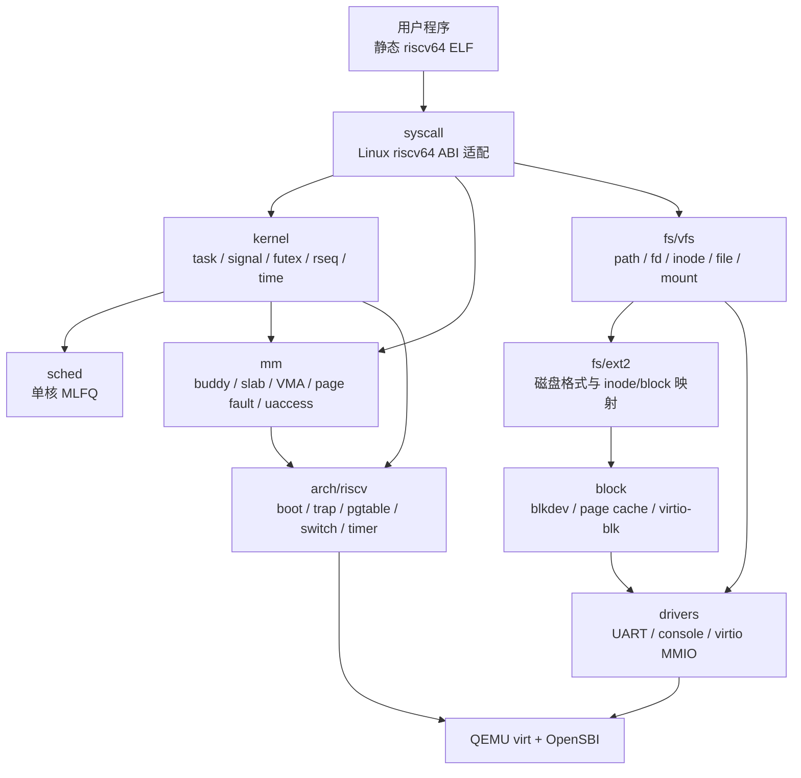
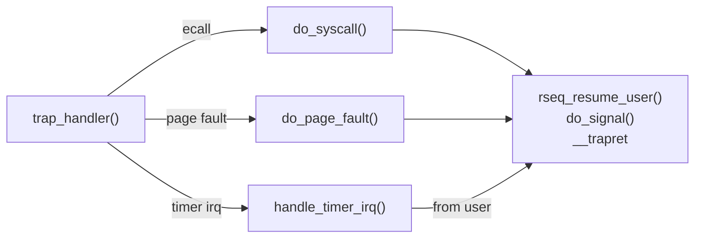

# cuteOS 架构总览

cuteOS 是一个面向 RISC-V 64 QEMU `virt` 平台的教学/实验 Unix-like 内核。当前代码的核心目标是运行真实的静态链接 riscv64 用户程序，并用小而清晰的内核结构承载 Linux riscv64 ABI 的关键行为。

本文档集只覆盖架构设计、核心工作原理和内部 API 边界。命令用法、实验步骤、项目背景叙述和面向用户的教程不在本文档集范围内。

## 当前运行模型

内核当前按以下假设组织：

- 平台：QEMU `virt`，OpenSBI 启动，RISC-V 64，Sv39。
- CPU：只启动 hart 0，`NR_CPUS` 结构保留但在线 CPU 为 1。
- 内核抢占：非抢占内核。timer tick 只在安全点触发调度。
- 用户抢占：用户态返回 trap 时可根据 `need_resched` 切换。
- I/O：UART 和 virtio-blk 都以轮询为主。
- 文件系统：根文件系统为 ext2，挂载在 virtio-blk major 8 minor 0。
- 用户 ABI：系统调用号、结构布局和 errno 以 Linux riscv64/uapi 语义为边界。

这些假设不是注释性背景，而是架构约束。锁、等待队列、futex、调度器、页缓存和驱动代码都依赖单核与非抢占内核模型。

## 分层结构

代码按职责大致分为以下层次：



```text
arch/riscv
  CPU 启动、trap entry/return、上下文切换、Sv39 页表、Sstc timer

kernel
  task、fork/exec/exit、signal、futex、rseq、time、waitqueue、sync、pid

sched
  单核 MLFQ 调度策略与 schedule() 核心

mm
  buddy、slab、vmalloc、用户 mm/VMA、page fault、uaccess、user_map

syscall
  Linux riscv64 syscall ABI 适配层

fs/vfs
  VFS 对象模型、路径解析、fdtable、挂载、字符设备、pipe

fs/ext2
  ext2 磁盘格式与 VFS 操作实现

block
  块设备注册、page cache、writeback、virtio-blk

drivers
  UART、console、virtio MMIO 基础定义

lib
  基础字符串、列表、位操作、哈希等内核工具
```

依赖方向应保持自上而下和横向 API 边界清晰：

- `syscall/` 只做 ABI 解码、用户指针复制和委派，不拥有核心语义。
- `fs/ext2/` 通过 VFS 与 page cache 接入，不绕过块设备抽象。
- `mm/` 通过页表 API 操作具体 RISC-V 页表，不让 syscall 直接改 VMA。
- `kernel/task` 作为任务生命周期聚合根，调度、信号、rseq、futex 都通过窄 API 接入。
- `arch/riscv` 拥有寄存器、CSR、trap frame、`satp` 和上下文切换细节。

## 启动到用户态

系统启动路径由 `docs/architecture/boot.md` 详细描述。核心流程是：

```text
OpenSBI
  -> arch/riscv/boot.S:_start
  -> 临时 Sv39 页表
  -> init/main.c:kernel_main()
  -> 子系统初始化
  -> virtio-blk 注册块设备
  -> ext2 mount_root()
  -> kernel_thread(init_process)
  -> exec_user_path("/bin/init")
  -> 用户态 /bin/init
```

启动期先使用 SBI console 输出，正式页表和 UART MMIO 初始化后切换到轮询 UART console。内存分配从 early bump allocator 过渡到 buddy，再到 slab/vmalloc。

## 核心执行路径

用户态运行时最重要的路径有四条。



系统调用路径：

```text
U-mode ecall
  -> entry.S 保存 trap_frame
  -> trap_handler()
  -> do_syscall()
  -> syscall handler
  -> 子系统 API
  -> rseq_resume_user()
  -> do_signal()
  -> __trapret/sret
```

缺页路径：

```text
page fault
  -> trap_handler()
  -> do_page_fault()
  -> find_vma()
  -> 匿名页分配或文件页缓存读入
  -> map_page()
  -> 返回重试故障指令
```

调度路径：

```text
timer interrupt
  -> jiffies++
  -> ktimer_run_expired()
  -> sched_tick()
  -> MLFQ 更新当前任务预算
  -> need_resched
  -> 用户 trap 返回前 schedule()
```

文件 I/O 路径：

```text
sys_read/sys_write
  -> fdtable 取 file
  -> vfs_read/vfs_write
  -> file_operations
  -> ext2 inode page_mapping
  -> page cache
  -> block_device_operations
  -> virtio-blk
```

## 关键对象

### task_struct

`task_struct` 是任务生命周期的聚合根，定义在 `include/kernel/task.h`。它按所有权分组保存：

- `arch`：RISC-V 上下文、trap frame、内核栈、`satp`。
- `ids`：`pid/tgid/pgid/group_leader`。
- `lifecycle`：状态、退出码、退出信号。
- `links`：父子关系、线程组链表、wait4 等待队列。
- `resources`：`mm/files/fs/sighand/signal/uid/gid`。
- `sigctx`：每线程信号 mask、pending、altstack、robust futex、clear_child_tid。
- `rseq`：restartable sequence 注册状态。
- `sched`：MLFQ runqueue 节点、时间片和重调度标志。
- `cputime`：用户态/内核态 tick 计费。

### mm_struct 和 VMA

`mm_struct` 的内部布局在 `mm/internal.h`，对外通过 `include/kernel/mm.h` 暴露。VMA 使用固定数组 `NR_VMA=16`，这使实现简单，但也要求 mmap/mprotect/munmap 在分裂 VMA 前先计算槽位需求。

### VFS 对象

VFS 公共对象定义在 `include/kernel/fs.h`：

- `super_block`：挂载实例。
- `inode`：文件元数据和 `i_pages` page mapping。
- `dentry`：目录项缓存。
- `file`：打开文件实例。
- `vfsmount/path`：挂载命名空间中的路径。

具体文件系统通过 `super_operations`、`inode_operations`、`file_operations` 接入。

### page_mapping 和 page_cache

`page_mapping` 是 page cache 的命名域。inode mapping 的 index 是文件逻辑块号，block device mapping 的 index 是磁盘物理块号。page cache 只以 `(mapping, index)` 作为 key，不嵌入 ext2 布局知识。

## API 边界原则

架构上应保持以下边界：

- ABI 入口在 `syscall/`，但业务语义归属对应子系统。
- RISC-V 寄存器和 CSR 细节只通过 `arch/*` facade 暴露。
- VFS 之上的代码不直接调用 ext2 私有函数。
- ext2 不直接驱动 virtio-blk，而是通过 block device 和 page cache。
- 任务资源通过 `task_*` 访问器管理，避免跨模块直接写内部分组字段。
- 用户指针通过 `copy_to_user()`、`copy_from_user()`、`strncpy_from_user()` 和显式 ABI 例外处理。

## 文档地图

- [boot.md](boot.md)：OpenSBI 到 PID 1 的启动路径。
- [compile.md](compile.md)：构建系统、对象组织、链接布局和镜像生成。
- [trap.md](trap.md)：trap entry/return、syscall、page fault、timer 中断和用户返回工作。
- [pgtable.md](pgtable.md)：Sv39 地址空间、PTE、内核/用户页表和 TLB。
- [memory.md](memory.md)：buddy、slab、vmalloc、mm/VMA、uaccess 和缺页。
- [task.md](task.md)：task、fork/clone、exec、exit/wait、signal、futex、rseq、time。
- [sched.md](sched.md)：MLFQ、调度点、等待队列和同步原语。
- [syscall.md](syscall.md)：Linux riscv64 syscall ABI 适配规则和 handler 组织。
- [vfs.md](vfs.md)：VFS 对象模型、路径、fd、挂载、字符设备和 pipe。
- [ext2.md](ext2.md)：ext2 私有结构、inode/data/dir 操作和块映射。
- [block.md](block.md)：块设备、page cache、writeback、virtio-blk。

这些文档互相引用的是架构关系，不替代头文件中的精确声明。涉及函数签名、结构字段和常量时，以代码中的头文件为准。
