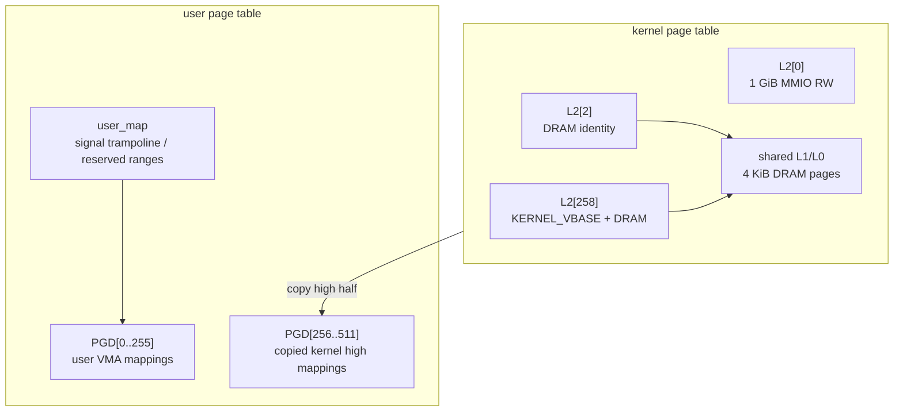

# 页表架构

cuteOS 在 RISC-V 64 上使用 Sv39 三层页表。页表层负责虚拟地址到物理地址的映射、内核高半区布局、用户页表创建、PTE 权限封装和 TLB 刷新。更高层的 `mm` 只通过页表 API 建立或查询映射。

## 地址空间布局

关键常量由架构页头和链接脚本共同决定：



- DRAM 物理基址：`DRAM_BASE`
- DRAM 大小：`DRAM_SIZE`
- 内核高半区基址：`KERNEL_VBASE = 0xFFFFFFC000000000`
- 内核链接起点：`KERNEL_VBASE + 0x80200000`
- 页大小：4 KiB
- 用户地址上限：`TASK_SIZE`

内核正式页表包含三类映射：

```text
低地址 MMIO 1 GiB mega page
DRAM 恒等映射
DRAM 高半区 4 KiB 映射
```

用户页表复制内核高 256 个 PGD 项，因此用户态 trap 进入内核后仍能访问内核 text/data/stack/MMIO 映射。用户低半区 PGD 项由 `mm` 和 `user_map` 填充。

## PTE 定义

`arch/riscv/include/asm/pte.h` 定义 RISC-V PTE 位：

| 位 | 名称 | 含义 |
| --- | --- | --- |
| 0 | `PTE_V` | valid |
| 1 | `PTE_R` | readable |
| 2 | `PTE_W` | writable |
| 3 | `PTE_X` | executable |
| 4 | `PTE_U` | user accessible |
| 5 | `PTE_G` | global |
| 6 | `PTE_A` | accessed |
| 7 | `PTE_D` | dirty |

页表指针项是 `PTE_TABLE = PTE_V`，即 valid 但没有 R/W/X。

常用权限组合：

```c
PTE_KERN_R
PTE_KERN_RX
PTE_KERN_RW
PTE_KERN_RWX
PTE_USER_R
PTE_USER_RX
PTE_USER_RW
PTE_USER_RWX
```

更通用的权限构造由 `pgprot_user(read, write, exec)` 和 `pgprot_kernel(read, write, exec)` 提供。写权限会隐式带读权限，符合 RISC-V PTE 约束。

## 正式内核页表初始化

`pagetable_init()` 使用 early bump allocator 从 `_end` 后分配页表页。初始化流程：

1. `early_alloc_ptr = ALIGN_UP(_end, PAGE_SIZE)`。
2. 分配 root page table。
3. 逐 4 KiB 映射整个 DRAM 到 `KERNEL_VBASE + pa`。
4. 将 DRAM 恒等映射根项指向高半区映射的同一 L1 页。
5. 在 root `L2[0]` 安装 1 GiB MMIO mega page。
6. 计算 `SATP_MODE_SV39 | (root_pa >> PAGE_SHIFT)`。
7. 写入 `satp`，刷新 TLB。

DRAM 高半区和恒等映射共享下级页表，这让启动阶段从临时页表切换到正式页表时不会丢失当前执行路径。

## 页表页分配器切换

页表层内部有一个页分配函数指针：

```c
typedef void *(*page_alloc_fn)(void);
```

启动早期使用 `early_alloc_page()`。`buddy_init()` 完成后，`kernel_main()` 调用 `pagetable_use_buddy()`，把页表页分配切换为 `get_free_page(0)`。

这个切换点很重要：

- `buddy_init()` 通过 `bootmem_end()` 得知 early allocator 已消耗的内存。
- 切换后，用户页表、中间页表和运行时映射都从 buddy 分配。

## 页表遍历与映射 API

公共 API 位于 `arch/riscv/include/arch/pgtable.h`：


```c
void pagetable_use_buddy(void);
pte_t *current_pt(void);
pte_t *kernel_pt(void);
uintptr_t kernel_satp(void);
pte_t *pagetable_lookup_current(uintptr_t va);
pte_t *pagetable_lookup(pte_t *root, uintptr_t va);
void pagetable_write_current(uintptr_t va, uintptr_t pa, pte_t perm);
int map_page(pte_t *root, uintptr_t va, uintptr_t pa, uint64_t perm);
```

`map_page()` 只建立 4 KiB 叶子映射。它要求：

- `va` 页对齐。
- `pa` 页对齐。
- `perm` 包含 `PTE_V`。

缺失的中间页表由 `pt_walk_create()` 分配。若遇到中间层已有 leaf PTE，则返回 `-EINVAL`，防止把 mega page 当作页表页继续遍历。

`pagetable_lookup()` 不分配页表页，只在完整 L2 -> L1 -> L0 路径存在时返回叶子 PTE 指针。

## 用户页表创建

用户页表由 `mm_create_user_pgd()` 创建，位于 `mm/mmap.c`。流程：

1. 从 buddy 分配一个 PGD 页。
2. 清零低半区用户项。
3. 复制当前内核页表 `PGD[256..511]`。
4. 调用 `user_map_apply(user_pgd)` 安装特殊用户映射。

特殊用户映射通过 `include/kernel/user_map.h` 注册。当前启动时注册：

- 用户栈保护区保留范围。
- signal trampoline 页面。

`mm_user_satp(mm)` 使用 `pgtable_make_user_token(mm->pgd)` 生成 task 可安装的 `satp` 值。

## 地址空间切换

调度切换时，`arch_task_switch_address_space(prev, next)` 选择 next 的地址空间：

```text
next->arch.satp != 0 -> 使用 next 用户页表
next->arch.satp == 0 -> 使用 kernel_satp()
```

如果 prev 和 next 的有效 `satp` 相同，则不刷新。否则：

```c
csr_write(satp, satp_val);
tlb_flush_all();
```

`__trapret` 返回用户态前也会从当前 task 取 `TASK_SATP` 并写入 `satp`，保证执行用户代码时使用用户页表。

## TLB 与 PTE 更新

架构层提供：

```c
void flush_tlb_all(void);
void flush_tlb_page(uintptr_t va);
```

当前实现偏保守：

- 地址空间切换刷新全部 TLB。
- 单页映射或权限变化刷新对应页。
- `pagetable_write_current()` 写当前页表已有映射后刷新该页。

mm 层在 page fault、munmap、mprotect、mremap、madvise 等路径中负责调用对应刷新函数。

## 用户权限检查

页表 facade 提供常用判断：

```c
bool pte_is_present(pte_t pte);
bool pte_is_user_page(pte_t pte);
bool pte_allows_user_read(pte_t pte);
bool pte_allows_user_write(pte_t pte);
bool pte_allows_user_exec(pte_t pte);
paddr_t pte_phys_addr(pte_t pte);
pgprot_t pte_leaf_prot(pte_t pte);
pte_t pte_make(paddr_t pa, pgprot_t prot);
```

`pte_is_user_page()` 要求 `PTE_U` 且物理地址非 0。mm 的驻留页判断、uaccess 预探和页释放逻辑都依赖这些 helper。

## 设计约束

- 页表层只负责映射机制，不决定 VMA 语义。
- 用户地址空间生命周期由 `mm_struct` 管理，不由 task 或 syscall 直接释放页表。
- 内核高半区映射通过复制 PGD 高半区共享给用户页表；不要为每个进程重复构造内核页表。
- 修改 PTE 位定义时必须同步 RISC-V 特权规范、页表 helper、缺页权限检查和用户 ABI 行为。
- 不要跳过 `map_page()` 直接手写中间页表，除非是在页表层内部维护启动映射。
