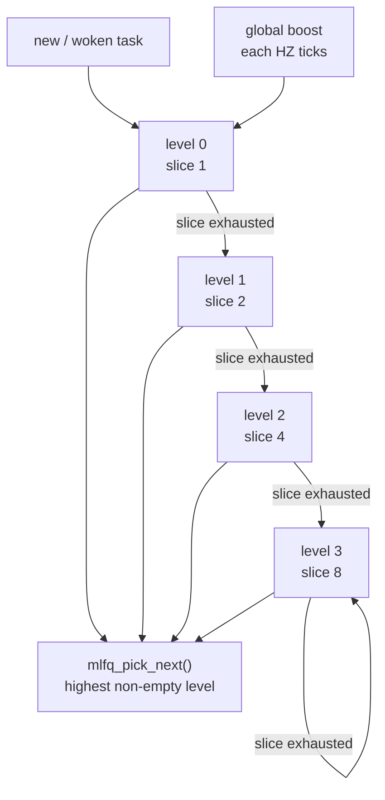
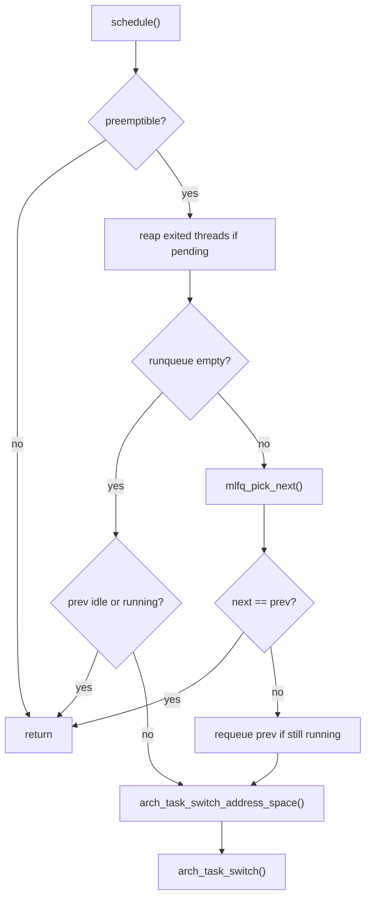

# 调度架构

cuteOS 当前调度器是单核、非抢占内核模型下的 4 级 MLFQ。timer tick 负责计费和设置重调度标志，真正的上下文切换只发生在显式 `schedule()` 调用或用户 trap 返回安全点。

## 代码边界

主要文件：

- `include/kernel/sched.h`：调度器公共 API。
- `sched/sched.c`：调度核心和架构切换编排。
- `sched/mlfq.c`：多级反馈队列策略。
- `sched/internal.h`：调度内部接口。
- `arch/riscv/switch.S`：低级 callee-saved 上下文切换。
- `arch/riscv/task.c`：地址空间切换和 task 架构状态。
- `kernel/wait channel.c`：等待队列。
- `kernel/sync.c`：mutex。

调度器只负责选择 runnable task 和调用架构切换。task 生命周期、信号、futex、wait4 等语义不应塞进调度策略层。

## 单核假设

当前 `task_init()` 只让 CPU 0 online。调度器全局队列没有 per-CPU 分片，也没有跨 CPU 负载均衡。spinlock 和 wait channel 使用 irqsave 是为了保护中断上下文交错，而不是多核并发。

`preempt_disable()`/`preempt_enable()` 修改 `current_cpu()->preempt_count`。`schedule()` 开头检查：

```c
if (!preemptible())
    return;
```

因此内核临界区内不会主动切换。

## 调度实体

`task_struct.sched` 包含：

```c
struct task_sched_entity {
    struct list_head run_list;
    struct wait_entry wait_entry;
    volatile uint8_t need_resched;
    uint8_t sched_level;
    uint8_t time_slice;
    uint8_t sched_ticks;
    uint64_t enqueue_jiffies;
};
```

其中：

- `run_list` 是 MLFQ 队列节点。
- `wait_entry` 是等待队列节点。
- `need_resched` 由 timer tick 设置，用户 trap 返回点消费。
- `sched_level` 是 MLFQ 层级，0 最高。
- `time_slice` 是当前层剩余预算。
- `sched_ticks` 记录已用 tick。
- `enqueue_jiffies` 用于记录入队时间。

## MLFQ 策略

`SCHED_MLFQ_LEVELS = 4`。每级时间片为：



```c
slice(level) = 1 << level
```

即：

| level | tick 预算 |
| --- | --- |
| 0 | 1 |
| 1 | 2 |
| 2 | 4 |
| 3 | 8 |

`sched/mlfq.c` 维护：

- `queues[4]`：每级 FIFO list。
- `nonempty_bitmap`：快速查找非空队列。
- `runnable_count`：当前 runnable task 数。

入队规则：

- 新 task 从 level 0 开始。
- `mlfq_enqueue()` 加到当前 level 队尾。
- `mlfq_pick_next()` 从最低 level 数字的非空队列取队首，并出队。
- `mlfq_wakeup()` 保持 level，但刷新该 level 完整时间片。

tick 规则：

- 当前非 idle running task 每 tick 减少 `time_slice`。
- `time_slice` 到 0 时，如果未到最低优先级则 level++。
- 重置该 level 的时间片。
- 设置 `need_resched=1`。

每当 `jiffies % HZ == 0`，执行全局 boost：所有队列中任务和当前 running task 回到 level 0。

## schedule()

`schedule()` 的核心流程：



1. 如果不可抢占，直接返回。
2. 如果有待回收 exited threads，先 `reap_exited_threads()`。
3. 取 `prev = current_task()`。
4. 如果 runqueue 为空：
   - 当前是 idle 或仍 running，则继续运行。
   - 否则切到 idle。
5. 如果 runqueue 非空：
   - `next = mlfq_pick_next()`。
   - 如果 next 是 prev，返回。
   - 如果 prev 非 idle 且仍 running 且不在 runqueue，将 prev 重新入队。
   - 检查 prev 栈 canary。
   - `rseq_sched_switch(prev)`。
   - `set_current_task(next)`。
   - `arch_task_switch_address_space(prev, next)`。
   - `arch_task_switch(prev, next)`。

运行中的 task 通常不在 runqueue 中。被切走时，如果仍 `TASK_RUNNING`，调度器才重新入队。

## 地址空间和上下文切换

调度核心通过架构层切换：

```c
void arch_task_switch_address_space(const struct task_struct *prev,
                                    const struct task_struct *next);
void arch_task_switch(struct task_struct *prev,
                      struct task_struct *next);
```

地址空间切换选择 next 的 `satp`，若为 0 则使用 kernel page table。不同 `satp` 时写 CSR 并 flush TLB。

`switch.S` 只保存 callee-saved 上下文，即内核调度上下文；完整用户寄存器由 trap frame 保存，不由 context switch 保存。

## timer 抢占点

timer interrupt 中：

```text
handle_timer_irq()
  -> jiffies++
  -> arch_timer_set(next)
  -> timer_run_expired(now)
  -> sched_tick()
```

如果 trap 来源是用户态，且当前 task `need_resched`，trap handler 会：

```c
task_set_need_resched(current_task(), 0);
schedule();
```

这意味着用户代码可被 timer tick 抢占；内核代码不会在任意位置被异步抢占，只在显式调用 `schedule()` 或等待路径中切换。

## 主动让出 CPU

`sched_yield()`：

- 忽略 idle。
- 清除当前 task 的 `need_resched`。
- 调用 `schedule()`。

当前任务在 `schedule()` 中如果仍 running 会被放回同级队尾。yield 不主动降级，也不刷新剩余时间片。

## 等待队列

等待队列定义在 `include/kernel/wait.h`，实现位于 `kernel/wait channel.c`。

基本对象和 interface：

```c
struct wait_channel {
    spinlock_t lock;
    struct list_head waiters;
};

struct wait_request {
    enum wait_type type;
    wait_check_fn probe;
    void *arg;
    uint32_t channel_limit;
};
```

`wait_for()` 是唯一通用阻塞入口。condition check 在拥有 event state 的
adapter 内检查或领取 event，并通过 opaque wait context 注册 wait channel。
`kind` 是 wait outcome 的 dispatch 标签；条件对象本身仍由 adapter 拥有，
其内部 check 只在 adapter 的 adapter lock 下检查/领取并登记，锁顺序为 source
lock 后 wait-channel lock。

等待流程由 wait module 统一拥有：

1. check 并 watch一个或多个 wait channel。
2. 设置 current task 为 interruptible 或 uninterruptible sleep。
3. 再次 check，关闭登记到真正阻塞之间的 lost-wakeup 窗口。
4. 按 `EVENT > SIGNAL > TIMEOUT` 选择 wait outcome。
5. 无 outcome 时调度或执行 WFI；无 event 的 wake 作为 spurious wake 内部重试。
6. 所有返回路径恢复 `TASK_RUNNING`，取消 timeout，并清理全部登记。

活动等待上下文仍由 `wait_for()` 的调用栈拥有，但 current task 暂存一个
opaque 指针，使 task exit 能在释放 sibling 内核栈前调用 `wait_cancel_task()`，
同步撤销 wait-queue registrations 和栈上 deadline timer。该指针不暴露 probe、
wait session 或 timer 实现，也不把等待策略移入 task module。

对外 API 包括：

```c
void wait_channel_init(struct wait_channel *channel);
int wait_session_watch(struct wait_session *session,
                  struct wait_channel *channel);
int wait_for(const struct wait_request *request,
                  wait_flags_t flags,
                  const struct wait_deadline *deadline,
                  wait_outcome_t *outcome);
void wait_cancel_task(struct task_struct *task);
struct task_struct *wait_channel_wake_one(struct wait_channel *channel);
void wait_channel_wake_one(struct wait_channel *channel);
void wait_channel_wake_all(struct wait_channel *channel);
```

wait outcome 是内核语义结果，不是 errno。sleep、futex、pipe、poll 和
child-wait adapter 分别把 EVENT、SIGNAL、TIMEOUT 映射为所属 ABI 的返回值。timeout
implementation 使用 ktimer；若 runqueue 为空且中断关闭，wait module 会临时
打开中断并执行 WFI，返回前恢复原 IRQ 状态。

唤醒只表示条件可能发生变化，不是完成凭证。wait outcome 在每次唤醒后
重新执行 condition check，因此虚假唤醒、重复唤醒和条件在注册后变化都走同一
条重试路径；所有返回路径撤销 registration、取消 timeout，并恢复
`TASK_RUNNING`。`WAIT_KIND_MUTEX`、`WAIT_KIND_FUTEX`、`WAIT_KIND_PIPE`、
`WAIT_KIND_POLL` 和 `WAIT_KIND_CHILD` 由各 adapter 标记，通用测试使用
`WAIT_KIND_GENERIC`。

## mutex

`kernel/sync.c` 实现的 mutex 建立在 spinlock 和 wait channel 之上：

```c
void mutex_init(mutex_t *mutex);
bool mutex_trylock(mutex_t *mutex);
void mutex_lock(mutex_t *mutex);
void mutex_unlock(mutex_t *mutex);
```

mutex 内部有：

- 自旋锁保护 owner 字段。
- wait channel 存放等待者。
- owner 必须是当前任务才能 unlock。

`mutex_lock()` 获取失败时，将当前任务加入 wait channel 并进入不可中断睡眠。`mutex_unlock()` 清空 owner 并 `wait_channel_wake_one()`。

## 设计约束

- 调度策略不拥有 task 生命周期资源释放，exit 路径只通过状态和队列与调度器协作。
- 运行中 task 不应同时留在 runqueue。
- channel watch 属于一次 `wait_for()` invocation，不是 task 长期状态；
  task 仅暂存用于 exit cancellation 的 opaque 活动上下文。
- source、probe context、所有登记 wait channel 及其 owner 必须存活到等待返回。
- tick 只设置重调度标志；不要在任意内核上下文引入异步抢占。
- 多核支持不能只增加 `-smp`，还需要重新设计 runqueue、锁、current task 和 TLB shootdown。
