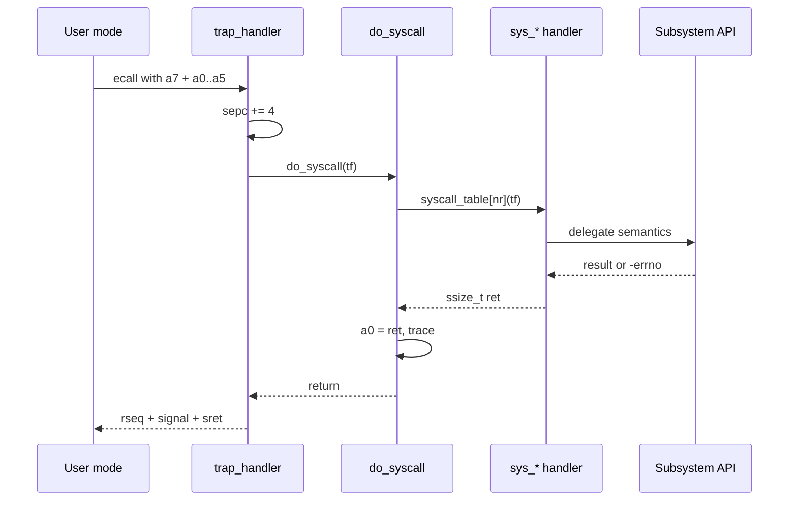
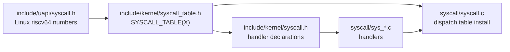

# 系统调用架构

系统调用层是 Linux riscv64 ABI 到 cuteOS 内核子系统的适配层。它负责系统调用号、参数寄存器、返回值、用户指针复制和错误码转换；核心语义应委派给 task、mm、VFS、time、signal、futex 等子系统。

## ABI 入口

RISC-V Linux syscall ABI 使用：



- `a7`：系统调用号。
- `a0-a5`：最多 6 个参数。
- `a0`：返回值。
- 负 errno：错误返回。

trap 层在 `EXC_ECALL_U` 分支中先执行 `sepc += 4` 跳过 `ecall`，再调用 `do_syscall(tf)`。系统调用完成后继续执行用户返回工作：rseq 和 signal。

## 号表来源

Linux riscv64 syscall number 定义在 `include/uapi/syscall.h`。该头由内核和用户态最小 libc 共享。

示例：

```c
#define SYS_read   63
#define SYS_write  64
#define SYS_exit   93
#define SYS_clone  220
#define SYS_execve 221
#define SYS_rseq   293
#define SYS_faccessat2 439

#define NR_SYSCALL (SYS_faccessat2 + 1)
```

该文件还用 `_Static_assert` 校验部分 timer syscall 号，防止 ABI 偏移。

新增 syscall 时必须先确认 Linux riscv64 号，再加入该 uapi 头。

## 单一 syscall 表

`include/kernel/syscall_table.h` 是分发元数据的单一来源：



```c
#define SYSCALL_TABLE(X) \
    X(SYS_read, "read", sys_read) \
    ...
```

每个条目包含：

1. syscall number 宏。
2. trace 名称。
3. handler 函数。

`include/kernel/syscall.h` 用该宏表生成 handler 声明：

```c
#define DECLARE_SYSCALL(nr, name, fn) ssize_t fn(struct trap_frame *);
SYSCALL_TABLE(DECLARE_SYSCALL)
```

`syscall/syscall.c` 用同一张宏表安装分发表：

```c
#define INSTALL_SYSCALL(nr, name, fn) syscall_table[nr] = fn;
SYSCALL_TABLE(INSTALL_SYSCALL)
```

这避免声明、安装和 trace 名称分裂。

## handler 签名

所有 handler 统一为：

```c
ssize_t sys_name(struct trap_frame *tf);
```

handler 通过 trap accessor 取参数：

```c
syscall_arg(tf, 0);
...
syscall_arg(tf, 5);
```

统一传入 `trap_frame *` 的原因：

- execve 需要安装新的用户 PC/SP。
- sigreturn 需要恢复整个 trap frame。
- clone 需要复制父 trap frame 构造子任务。
- rseq/signal 可能依赖当前 trap frame。

普通 syscall handler 应尽量薄：解码参数、复制用户数据、调用子系统 API、返回结果。

## 分发流程

`do_syscall(tf)` 执行：

1. `nr = syscall_nr(tf)`。
2. 若 `nr >= NR_SYSCALL` 或表项为空，返回 `-ENOSYS`。
3. 调用 `syscall_table[nr](tf)`。
4. 将 handler 返回值写入 `a0`。

未知 syscall 返回 `-ENOSYS`。

`syscall_init()` 还会调用 `futex_init()`，因为 futex wait bucket 是 syscall 触发的全局服务。

## 文件组织

`syscall/` 当前按语义分组：

| 文件 | 责任 |
| --- | --- |
| `syscall.c` | 分发表安装和 dispatch |
| `sys_exec.c` | execve ABI |
| `sys_proc.c` | pid/tid、process group、uid/gid 查询、exit/exit_group |
| `sys_task.c` | clone、wait4 |
| `sys_sched.c` | sched_yield、sched_setaffinity、sched_getaffinity |
| `sys_signal.c` | kill/tkill/tgkill/sigaction/sigprocmask/sigreturn/sigaltstack |
| `sys_time.c` | clock、nanosleep、itimer、POSIX timer、gettimeofday、times |
| `sys_futex.c` | futex、robust list、set_tid_addr |
| `sys_rseq.c` | rseq |
| `sys_mm.c` | brk、mmap、munmap、mprotect、mremap、msync、mlock、mincore、madvise |
| `sys_membarrier.c` | membarrier |
| `sys_file_io.c` | read/write/readv/writev/pread/pwrite/sendfile/splice |
| `sys_file_path.c` | openat、mkdirat、linkat、unlinkat、renameat2、mount、chdir 等 |
| `sys_file_stat.c` | stat/fstat/statx/statfs/faccessat |
| `sys_file_poll.c` | ppoll/pselect/epoll stubs or routing |
| `sys_file_helpers.c` | fd/path/stat helper |
| `sys_misc.c` | uid/gid/groups/umask/uname/sysinfo/prlimit/getrusage/getrandom |
| `sys_log.c` | syslog |
| `sys_stub.c` | 真正 probe-safe、unsupported 或 reserved 的占位入口 |

实际行为以 handler 和下层子系统代码为准；文件名只是组织方式。

## 用户指针规则

syscall 层处理用户指针时应使用 mm/uaccess API：

```c
copy_from_user()
copy_to_user()
strncpy_from_user()
user_range_probe()
access_ok()
```

常见规则：

- 输入结构体先复制到内核栈或 kmalloc 缓冲区，再验证字段。
- 输出结构体先构造内核副本，再一次性 `copy_to_user()`。
- 用户字符串使用 `strncpy_from_user()`，并设置最大长度。
- 指针为空是否允许由 Linux ABI 语义决定。
- `copy_*_user()` 返回非 0 时，handler 返回 `-EFAULT`。

少数 ABI 副作用不在 syscall 入口发生，例如 exit-time `clear_child_tid` 和 robust futex list，它们属于 task teardown 语义。

## 错误码与返回值

内核内部使用负 errno。syscall handler 直接返回：

- 非负值：成功结果。
- `0`：成功无值。
- 负值：`-EINVAL`、`-EFAULT`、`-ENOSYS` 等。

`do_syscall()` 不做额外 errno 翻译，只把返回值写到 `a0`。

指针型结果也用 `ssize_t` 承载。例如 mmap 成功返回用户地址，失败返回负 errno。

## 子系统委派

系统调用层应保持薄封装：

| syscall 组 | 下层 API |
| --- | --- |
| `read/write/open/stat` | VFS、fdtable、uaccess |
| `mmap/brk/mprotect` | `mm_*` API |
| `clone/exit/wait` | task/fork/exit API |
| `execve` | exec loader |
| `kill/sigaction/sigreturn` | signal API |
| `futex` | futex API |
| `clock/nanosleep/timer` | time/timer API |
| `membarrier/rseq` | mm registrations/rseq API |

不要因为入口位于 `syscall/` 就把核心状态或算法放入 syscall 文件。

## 支持面策略

`include/uapi/syscall.h` 不等于完整实现承诺。表中安装的 handler 可能是：

- 完整实现。
- 最小兼容实现。
- 明确返回 `-ENOSYS` 的兼容入口。
- 为 busybox 或 libc 期望提供的窄语义。

架构文档记录的是当前实现边界。扩展 syscall 时应优先保证 Linux riscv64 ABI 的号、参数、结构布局和 errno，而不是追求一次性覆盖全部 Linux 行为。

## 新增 syscall 的结构约束

新增 syscall 应满足：

1. 在 `include/uapi/syscall.h` 使用 Linux riscv64 号。
2. 在 `include/kernel/syscall_table.h` 添加 `SYSCALL_TABLE` 条目。
3. 在合适的 `sys_*.c` 文件实现 `ssize_t sys_xxx(struct trap_frame *tf)`。
4. ABI 结构体放在 `include/uapi/`，内核私有 helper 放在子系统头。
5. handler 只做 ABI 适配，下层语义放到所属子系统。
6. 用户指针通过 uaccess。
7. 返回负 errno，不在 handler 中写 `tf->a0`，除非该 syscall 明确恢复/替换 trap frame。

## 设计约束

- syscall number 不能按表项顺序自增推断，必须使用 Linux riscv64 uapi 值。
- 不要让 syscall 层直接访问 VMA、ext2 私有结构或驱动 MMIO。
- 不要改变 handler 签名，否则 exec/sigreturn/clone 等 trap frame 语义会破坏。
- 不要在 syscall dispatch 中加入复杂策略；复杂语义应属于具体子系统。
