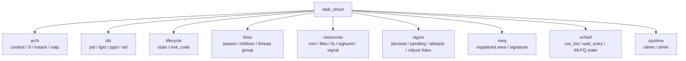
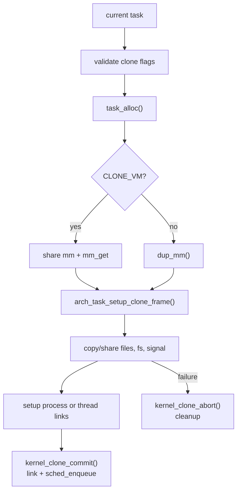
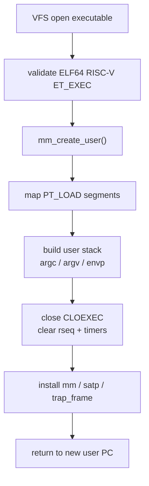
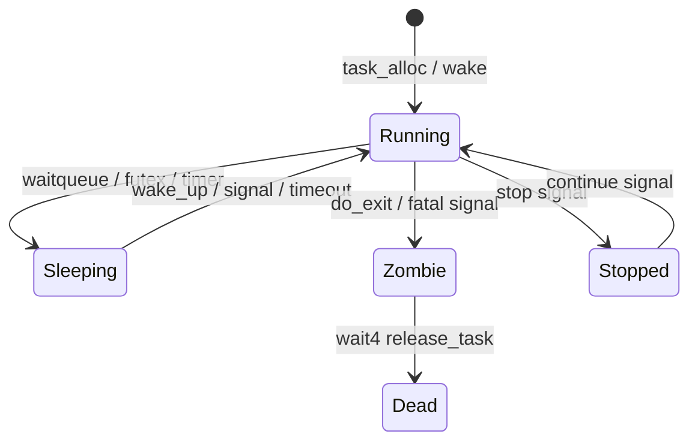

# 任务与内核核心服务

任务子系统负责进程/线程生命周期，并承载信号、futex、rseq、时间计时器、资源限制等与任务绑定的核心服务。`task_struct` 是这些状态的聚合根，但具体语义分散在对应子系统中。生命周期聚合、身份和通用资源连接可以留在 `task.h`；复杂语义和单一子系统字段访问应回到 owning subsystem 的头文件或实现内。

## task_struct 分组

`include/kernel/task.h` 将 `task_struct` 分为多个所有权清晰的子结构：



```c
struct task_struct {
    struct task_arch_state arch;
    struct task_identity ids;
    struct task_lifecycle lifecycle;
    struct task_links links;
    struct task_resources resources;
    struct task_signal_context sigctx;
    struct rseq_task_context rseq;
    struct task_sched_entity sched;
    struct task_cputime cputime;
    struct task_cputime child_cputime;
};
```

主要分组：

- `arch`：RISC-V 上下文、trap frame、内核栈、`satp`。
- `ids`：`pid/tgid/pgid/sid/group_leader`。
- `lifecycle`：任务状态、退出码、退出信号。
- `links`：父子链表、线程组链表、wait4 等待队列。
- `resources`：`mm/files/fs/sighand/signal/uid/gid`。
- `sigctx`：每线程信号状态、altstack、clear_child_tid、robust futex。
- `rseq`：restartable sequence 注册状态。
- `sched`：runqueue 节点、等待队列节点、MLFQ 状态。
- `cputime`：用户态/内核态 tick。

字段访问规则：

- `task.h` 只暴露生命周期聚合、`pid/tgid/pgid/sid`、父子/线程组连接、`mm/files/fs` 等跨子系统通用 helper。
- signal 相关 per-task helper 位于 `include/kernel/signal.h`。
- robust futex list 和 `clear_child_tid` helper 位于 `include/kernel/futex.h`。
- rseq 注册状态通过 `include/kernel/rseq.h` 的语义入口管理，字段级 helper 保持在 rseq 实现内部。
- scheduler 可以在 `sched/` 内直接访问 `task->sched`，task/fork/exit 可以在生命周期装配路径直接访问对应字段；其他模块不应为了方便绕过 owner API。

新增 per-task 状态时，先说明 owner、生命周期和访问边界，再决定是否进入 `task_struct`。

## 任务状态

当前状态位：

| 状态 | 含义 |
| --- | --- |
| `TASK_RUNNING` | 可运行或正在运行 |
| `TASK_UNINTERRUPTIBLE` | 不可中断睡眠 |
| `TASK_INTERRUPTIBLE` | 可被未屏蔽信号打断的睡眠 |
| `TASK_ZOMBIE` | 已退出，等待父进程回收 |
| `TASK_DEAD` | 已被释放 |
| `TASK_STOPPED` | 被停止信号暂停 |

`TASK_ANY_SLEEP` 是两个睡眠状态的组合。等待队列和 mutex 通过这些状态与调度器交互。

## CPU-local current

`kernel/task.c` 定义：

```c
struct cpu cpu_table[NR_CPUS];
uint32_t nr_cpu_ids;
```

当前只初始化 CPU 0：

- `nr_cpu_ids = 1`
- `cpu_table[0].state = CPU_ONLINE`
- `cpu_table[0].idle_task = &idle_task`
- `cpu_table[0].current_task = &idle_task`

`current_task()`、`set_current_task()` 和 preempt count 都通过 CPU-local wrapper 访问。虽然结构保留了多 CPU 形态，但当前调度和锁语义仍是单核。

## task 分配与释放

`task_alloc()` 执行：

1. `kmalloc(sizeof(struct task_struct))`
2. `get_free_page(KSTACK_ORDER)` 分配 8 KiB 内核栈。
3. `alloc_pid()` 分配 PID。
4. 清零并初始化 task 字段。
5. `arch_task_init()` 初始化架构状态。
6. 设置默认 `tgid=pid`、`pgid=pid`、`sid=pid`、`group_leader=self`。
7. 初始化调度字段、链表、等待队列。
8. 清零内核栈。
9. `pid_attach_task(pid, task)` 建立 PID 到 task 映射。

`task_free()` 反向释放 PID、文件/FS/信号资源、内核栈和 task 对象。

idle task 是 BSS 静态对象，不通过 `task_alloc()`，也不拥有普通任务内核栈。

## 内核线程

`kernel_thread(fn, arg)` 创建内核线程：

1. `task_alloc()`
2. `task_init_resources()`
3. `arch_task_setup_kernel_thread(task, fn, arg)`
4. 挂到当前任务 children 链表。
5. `sched_enqueue(task)`

RISC-V 架构层在新任务内核栈顶部构造 trap frame，设置 `ctx.ra = __trapret`。首次调度切入后通过 `sret` 进入 `fn(arg)`。

PID 1 和 page cache 写回线程都是内核线程创建出来的。

## fork/clone

clone 实现位于 `kernel/fork.c`。核心 API：



```c
int kernel_clone_prepare(struct trap_frame *tf, unsigned long flags,
                         uintptr_t child_stack, uintptr_t tls,
                         int *clear_child_tid,
                         struct kernel_clone *clone);
pid_t kernel_clone_commit(struct kernel_clone *clone);
void kernel_clone_abort(struct kernel_clone *clone);
ssize_t kernel_clone_from_frame(struct trap_frame *tf,
                                unsigned long flags,
                                uintptr_t child_stack,
                                int *parent_tid,
                                uintptr_t tls,
                                int *child_tid);
```

clone 被拆成 prepare/commit/abort，便于 syscall 层在需要写用户 TID 或处理中间失败时保持一致性。

当前 clone flag 策略：

- 支持 fork-like clone 和 pthread 所需线程子集。
- 不支持 namespace、pidfd、ptrace、vfork、parent、io、clone3-only 等复杂
  flag；这些组合在 validator 中固定返回 `-EINVAL`。
- `CLONE_DETACHED` 和 `CLONE_UNTRACED` 在当前无 ptrace 模型下作为兼容
  no-op 接受。
- `CLONE_SIGHAND` 要求 `CLONE_VM`。
- `CLONE_VM` 要求显式 child stack，并要求 `CLONE_SIGHAND`。
- `CLONE_THREAD` 要求 `CLONE_VM | CLONE_SIGHAND`。
- 非线程 clone 只能由线程组 leader 发起。
- 非线程 clone 不接受 `CLONE_CHILD_SETTID/CLONE_CHILD_CLEARTID/CLONE_SETTLS` 这些线程专用 flag。

资源复制策略：

- `CLONE_VM` 共享 mm，否则 `dup_mm()` 深拷贝地址空间。
- `CLONE_FILES` 共享 fdtable，否则复制。
- `CLONE_FS` 共享 cwd/root/umask 状态，否则复制。
- `CLONE_SIGHAND` 共享 handler 表。
- `CLONE_THREAD` 共享 signal_struct，并加入 leader 的线程组。
- rseq 在 `CLONE_VM` 下清空，否则继承注册状态。

## exec

exec 实现位于 `kernel/exec.c`。成功 exec 会替换当前任务的用户地址空间和 trap frame，但保留 PID、父子关系、打开文件等进程身份。



主要流程：

1. 通过 VFS 打开可执行文件。
2. 读取并验证 ELF64/RISC-V/ET_EXEC header。
3. 读取 program header table。
4. 创建新的 `mm_struct`。
5. 按 PT_LOAD 映射段，权限来自 ELF `p_flags`。
6. 构造单页用户栈，写入 `argc/argv/envp`。
7. `mm_finalize()` 设置 `brk/code_start/code_end`。
8. 关闭 `CLOEXEC` fd。
9. 清理 rseq 和 POSIX timers。
10. 安装新 `mm`、新 `satp` 和用户返回 trap frame。

exec 后返回用户态时，`trap_setup_user_return()` 设置新的 PC/SP 和用户态 `sstatus`。

## exit/wait

退出实现位于 `kernel/exit.c`。



`do_exit(code)` 对当前任务执行：

1. 如果是线程组非 leader，退出当前线程。
2. 如果是 leader，先结束其他线程。
3. 执行 robust futex exit walk。
4. 处理 `clear_child_tid` 并 futex wake。
5. 关闭 fd、释放 fs、释放信号状态。
6. 释放 mm 并切回 kernel page table。
7. leader 将子进程 reparent 给 `init_task` 或 idle。
8. 设置 `TASK_ZOMBIE`。
9. 向父进程发送 `SIGCHLD` 并唤醒 wait queue。
10. 调用 `schedule()`，不再返回。

`do_exit_group(code)` 以线程组为单位终止。

`kernel_wait4()` 等待子进程 zombie 状态，回收时将 child cputime 累加到父进程，并调用 `release_task()` 释放 task。

## PID 管理

PID 子系统位于 `kernel/pid.c` 和 `include/kernel/pid.h`。它用固定范围 bitmap 和 PID 到 task 映射管理任务查找。

任务创建时：

```text
alloc_pid()
pid_attach_task(pid, task)
```

任务释放时：

```text
pid_detach_task(pid, task)
free_pid(pid)
```

signal、wait、tgkill、futex robust list 查询都依赖 PID 映射。

## 信号模型

信号实现位于 `kernel/signal.c`，公共 API 在 `include/kernel/signal.h`。

信号状态分三层：

- `sighand_struct`：可共享的 handler table，带 refcount 和 mutex。
- `signal_struct`：线程组共享 pending、itimers、POSIX timers、rlimits。
- `task_signal_context`：每线程 blocked/pending/in_handler/altstack/robust list。

关键 API：

```c
int signals_init(struct task_struct *task);
int signals_clone(struct task_struct *child, bool share_sighand,
                  bool share_signal, bool disable_altstack);
void signals_release(struct task_struct *task);
int send_signal(int sig, struct task_struct *task);
int send_group_signal(int sig, struct task_struct *leader);
int force_signal(int sig, struct task_struct *task);
void do_signal(struct trap_frame *tf);
void signal_user_map_init(void);
```

信号投递发生在用户 trap 返回前。`do_signal(tf)` 查找未阻塞 pending 信号：

- 默认 fatal 信号调用 exit。
- `SIGKILL` 和 `SIGSTOP` 不可阻塞、不可捕获。
- ignored 信号清除 pending。
- handler 信号在用户栈或 altstack 上构造 `signal_frame`。

signal frame 保存原 trap frame、blocked mask、信号号和 altstack 状态。handler 返回时调用 signal trampoline 中的 `rt_sigreturn`，由 `do_sigreturn()` 恢复原始 trap frame 和 signal mask。

`SIGNAL_TRAMPOLINE_ADDR = USER_STACK_GUARD_BASE - PAGE_SIZE`，通过 `user_map` 映射进每个用户页表。

## futex

futex 实现位于 `kernel/futex.c`。当前支持：

- `FUTEX_WAIT`
- `FUTEX_WAKE`
- `FUTEX_WAIT_PRIVATE` / `FUTEX_WAKE_PRIVATE`
- `FUTEX_WAIT_BITSET` / `FUTEX_WAKE_BITSET`
- robust futex list exit-time 处理

等待 key 是：

```c
struct futex_key {
    struct mm_struct *mm;
    uintptr_t uaddr;
};
```

这表示 futex wait queue 按地址空间和用户地址区分。当前没有跨进程共享内存的全局 inode key。
`FUTEX_PRIVATE_FLAG` 是 pthread 路径的稳定支持面。`FUTEX_CLOCK_REALTIME`
在 wait op 上接受，但当前 `CLOCK_REALTIME` 与 mtime 同源，不提供真实墙钟
差异。requeue 和 PI futex op 目前固定返回 `-ENOSYS`，避免误导 libc 探测。

`kernel_futex()` 根据 `FUTEX_CMD_MASK` 分发。普通 `FUTEX_WAIT/WAKE` 按
`FUTEX_BITSET_MATCH_ANY` 处理；`FUTEX_WAIT_BITSET/WAKE_BITSET` 在 waiter
中保存 bitset，wake 时只唤醒 bitset 相交的 waiter。`FUTEX_WAIT` 的
timeout 是 relative；`FUTEX_WAIT_BITSET` 的 timeout 是 absolute。

`FUTEX_WAIT` 和 `FUTEX_WAIT_BITSET` 会：

1. 校验地址对齐和 `access_ok()`。
2. `user_range_probe()` 确保可读。
3. 在 bucket lock 下再次读取用户值。
4. 值不等于 expected 返回 `-EAGAIN`。
5. 加入 waiter list，并进入 interruptible sleep。
6. 被 wake、signal 或 timeout 唤醒。

退出时 `futex_exit_robust_list()` 遍历用户 robust list，设置 `FUTEX_OWNER_DIED` 并唤醒等待者。

## rseq

rseq 实现位于 `kernel/rseq.c`。当前是单核兼容实现：

- `cpu_id_start = 0`
- `cpu_id = 0`
- `node_id = 0`
- `mm_cid = 0`

注册要求：

- area 非空。
- len 等于 32。
- area 按 32 字节对齐。
- 用户范围合法。
- syscall flags 只支持 `0` 和 `RSEQ_FLAG_UNREGISTER`，其它返回
  `-EINVAL`。

核心 API：

```c
ssize_t kernel_rseq(struct rseq *area, uint32_t len,
                    int flags, uint32_t sig);
void rseq_execve(struct task_struct *task);
void rseq_clone(struct task_struct *child,
                const struct task_struct *parent,
                unsigned long flags);
void rseq_sched_switch(struct task_struct *prev);
int rseq_resume_user(struct trap_frame *tf);
int rseq_signal_deliver(struct trap_frame *tf);
```

调度切换时，如果 prev 是从用户态 trap 进来的且注册了 rseq，则设置 `need_update`。返回用户态前 `rseq_resume_user()` 更新用户 rseq area，并在 PC 位于 critical section 时校验 abort signature，清除 `rseq_cs` 并把 `sepc` 改到 abort IP。
`rseq_cs` 的 `NO_RESTART_ON_PREEMPT` 和 `NO_RESTART_ON_SIGNAL` 会抑制
对应事件的 abort；`NO_RESTART_ON_MIGRATE` 在当前单核模型下是 no-op。
未知 `rseq_cs` flag 或非 0 version 会在 active CS 的用户返回处理中变成
`SIGSEGV` 退出。

exec 清除 rseq。`CLONE_VM` 清除 child rseq；fork-like clone 继承。

## 时间与计时器

架构 timer 在 `arch/riscv/timer.c`，通用时间核心在 `kernel/time.c`。

平台常量：

```c
#define HZ 100UL
#define MTIME_FREQ 10000000UL
#define CLOCKS_PER_TICK (MTIME_FREQ / HZ)
```

`arch_timer_now()` 读取 `time` CSR，`arch_timer_set()` 写 `stimecmp`。timer interrupt 每 10ms 触发一次。

通用 ktimer API：

```c
void ktimer_init(struct ktimer *timer, ktimer_fn_t function, void *arg);
int ktimer_arm(struct ktimer *timer, uint64_t expires, uint64_t interval);
bool ktimer_cancel(struct ktimer *timer);
void ktimer_run_expired(uint64_t now);
```

ktimer queue 按 `expires` 排序。timer interrupt 中调用 `ktimer_run_expired(now)`，周期 timer 会重新插入。

signal_struct 内包含：

- `itimers[ITIMER_COUNT]`
- `posix_timers`
- `rlimits`

`ITIMER_REAL` 和 POSIX timer 可通过 ktimer 向目标 task 投递信号。

## worker

`kernel/worker.c` 提供很小的周期 worker helper：

```c
void worker_run_periodic(unsigned int interval_sec,
                         void (*work)(void *),
                         void *arg);
```

它循环计算下一次 deadline，调用 `timer_sleep_until(deadline, false)`，然后执行 work。page cache 写回线程用它每 5 秒调用一次全局同步。

## 设计约束

- task 是生命周期聚合根，但子系统语义应留在各自模块。
- `task.h` 不承载单一子系统的大批字段 helper；signal、futex、rseq 等 owner 头文件负责自己的 per-task helper。
- clone prepare/commit/abort 的事务边界不能被 syscall 层绕开。
- exec 成功后旧 `mm` 不再可用，后续代码不能访问旧用户地址。
- exit 在切换走前当前 task 已可能是 zombie 且无 mm，不要在 `do_exit()` 尾部新增用户访问。
- signal/rseq 的用户返回顺序是 ABI 语义的一部分。
- futex robust list 和 clear_child_tid 是 exit-time ABI 副作用，允许在 task teardown 中做 uaccess。
