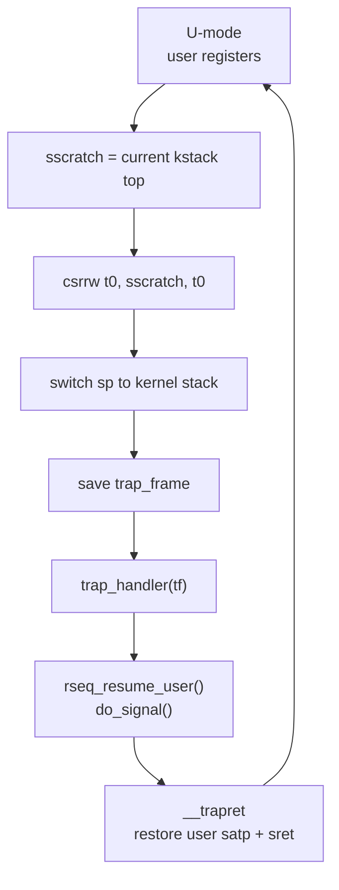
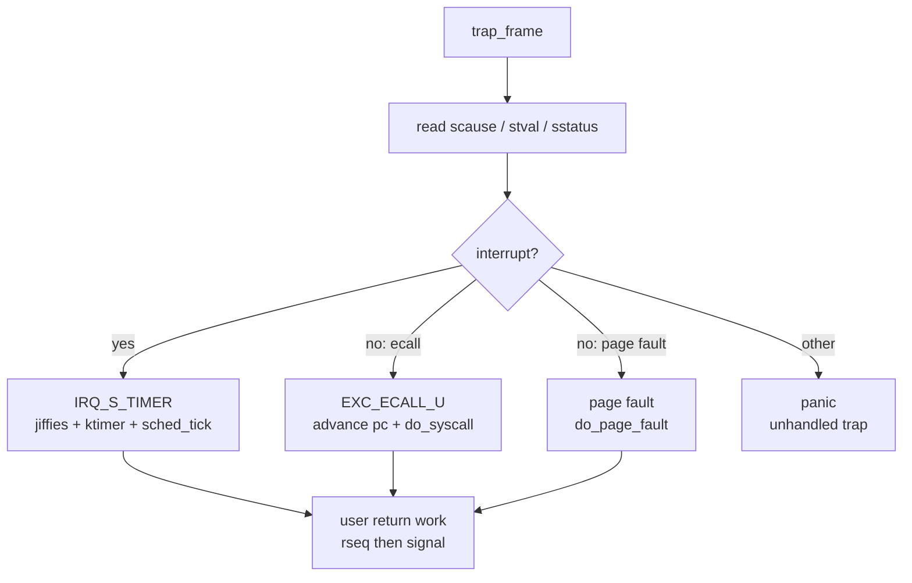

# Trap 与异常路径

trap 子系统连接用户态 ABI、内核调度、缺页处理和信号投递。RISC-V 汇编入口负责保存/恢复寄存器；C 层只通过 `trap_frame` facade 读取 trap 原因、系统调用参数和用户上下文。

## 代码边界

关键文件：

- `arch/riscv/entry.S`：`__alltraps` 和 `__trapret`。
- `arch/riscv/trap.c`：`trap_handler()` 分发异常和中断。
- `arch/riscv/trap_init.c`：初始化 `stvec/sscratch/sie/sstatus`。
- `arch/riscv/include/asm/trap_frame.h`：汇编/C 共享 trap frame 布局。
- `arch/riscv/include/arch/trap.h`：通用代码使用的 trap 访问器。
- `include/kernel/trap.h`、`include/kernel/trap_types.h`：通用 trap facade。

架构约束是：`entry.S` 和 `asm/trap_frame.h` 拥有实际寄存器布局；其他子系统不应按字段偏移手写访问，应该使用 `arch/trap.h` 中的 accessor。

## trap_frame 布局

`struct trap_frame` 保存：

- `sepc`
- 31 个通用寄存器中的调用相关寄存器和 callee-saved 寄存器
- `scause`
- `stval`
- `sstatus`

布局由 `asm/asm_offsets.h` 的偏移宏和 C `static_assert` 双向校验。`entry.S` 使用这些偏移保存和恢复寄存器。

该结构也是 syscall、signal、clone、exec 和 rseq 的共同上下文容器：

- syscall 从 `a7` 取号，从 `a0-a5` 取参数，返回值写回 `a0`。
- clone 复制父 trap frame，并将子返回值 `a0` 改为 0。
- exec 构造新的用户返回 frame。
- signal 保存完整 trap frame 到用户栈上的 signal frame。
- rseq 可在用户返回前改写 `sepc` 到 abort handler。

## trap 初始化

`trap_init()` 执行：

```c
csr_write(stvec, __alltraps);
csr_write(sscratch, 0);
csr_set(sie, SIE_STIE);
csr_set(sstatus, SSTATUS_SIE);
```

`stvec` 使用 direct mode，所有 trap 都进入同一个 `__alltraps`。`sscratch=0` 表示当前处于内核态；从用户态返回前，`__trapret` 会把 `sscratch` 设置为当前任务内核栈顶。

## U 到 S 的入口

用户态发生 trap 时，`sscratch` 持有当前任务内核栈顶。`__alltraps` 的第一条关键指令是：



```asm
csrrw t0, sscratch, t0
```

如果旧 `sscratch` 非零，说明来源是用户态：

1. 暂存用户 `sp`。
2. 切换到当前任务内核栈顶。
3. 在内核栈顶部向下分配 `trap_frame`。
4. 从 `sscratch` 取回用户态原始 `t0`。
5. 保存所有寄存器和 CSR。
6. 调用 `trap_handler(tf)`。

这一设计避免在用户栈上保存内核状态，也让每个 task 的内核栈天然承载最近一次用户 trap frame。

## S 到 S 的入口

如果旧 `sscratch` 为 0，说明 trap 来源是内核态。此时不切换栈，直接在当前内核栈上分配 `trap_frame`，保存寄存器并调用 `trap_handler()`。

当前 C 层对未处理的内核异常会 panic。内核态由 uaccess 触发的用户缺页通过 page fault 路径处理，但非法访问最终仍终止当前任务或 panic，取决于是否存在当前用户地址空间。

## trap 分发

`trap_handler()` 读取：

- `scause`：判断中断/异常和编号。
- `stval`：缺页地址。
- `sstatus.SPP`：判断来源是否用户态。

当前支持的分发：



| 类型 | 条件 | 处理 |
| --- | --- | --- |
| Supervisor timer interrupt | interrupt + `IRQ_S_TIMER` | `handle_timer_irq()` |
| 用户 ecall | exception + `EXC_ECALL_U` | `trap_advance_pc(tf, 4)` 后 `do_syscall(tf)` |
| 指令缺页 | `EXC_INST_PAGE_FAULT` | `do_page_fault(tf)` |
| 读缺页 | `EXC_LOAD_PAGE_FAULT` | `do_page_fault(tf)` |
| 写缺页 | `EXC_STORE_PAGE_FAULT` | `do_page_fault(tf)` |

其他中断或异常进入 panic，并输出来源、`scause`、`sepc`、`stval`。

## timer trap

timer 中断处理函数执行：

```text
now = arch_timer_now()
jiffies++
arch_timer_set(now + CLOCKS_PER_TICK)
timer_run_expired(now)
sched_tick()
```

`sched_tick()` 更新当前任务用户/内核 tick 计费，并让 MLFQ 策略消耗时间片。时间片耗尽时只设置 `task->sched.need_resched`。

如果 timer trap 来源是用户态，且当前任务需要重调度，`trap_handler()` 会清除 `need_resched` 并调用 `schedule()`。这就是当前用户态时钟抢占点。

## syscall trap

用户态 `ecall` 进入 `EXC_ECALL_U` 分支：

1. `trap_advance_pc(tf, 4)` 跳过 `ecall` 指令。
2. `do_syscall(tf)` 读取 `a7/a0-a5` 并分发表。
3. handler 返回负 errno 或非负结果。
4. `do_syscall()` 将结果写入 `a0`。
5. 用户返回前执行 rseq 和 signal 工作。

syscall handler 的签名统一是：

```c
ssize_t handler(struct trap_frame *tf);
```

它们不直接接收展开后的参数，是为了允许 exec/sigreturn 等系统调用改写整个 trap frame。

## page fault trap

缺页异常不推进 `sepc`，因为处理成功后需要重新执行故障指令。

`do_page_fault()` 通过 trap facade 判断访问类型：

- instruction fault -> exec
- load fault -> read
- store fault -> write

然后在当前任务 `mm` 中查找 VMA。合法缺页会：

- 为匿名 VMA 分配清零物理页。
- 为 file-backed VMA 从 inode page cache 读入页。
- 为 shared file mapping 映射页缓存页。
- 调用 `map_page()` 建立用户 PTE。
- flush 对应 TLB 页。

非法地址、权限不匹配或已有 PTE 权限不允许访问时，用户态来源会投递或触发 `SIGSEGV`，内核态来源会终止当前任务。

## 用户返回工作

从用户态进入的 syscall、page fault 和 timer 分支，在返回用户态前都会执行：

```c
rseq_resume_user(tf);
do_signal(tf);
```

顺序很重要：

1. rseq 先检查是否需要更新用户 rseq area，必要时处理 critical section abort。
2. signal 再决定是否在用户栈上建立 signal frame 并改写 `sepc/sp/ra/a0`。

signal 投递本身还会强制调用 `rseq_signal_deliver(tf)`，保证信号打断 rseq critical section 时符合 rseq 语义。

## __trapret 返回

`__trapret` 先恢复 CSR 和通用寄存器，再根据 `sstatus.SPP` 区分返回目标。

返回用户态时：

1. 从 `cpu_table[0].current_task` 找到当前 task。
2. 取 task 的 `kstack`，计算内核栈顶。
3. 将 `sscratch` 设为内核栈顶，供下一次 U->S trap 使用。
4. 将 `satp` 切换到 task 的用户页表；如果 `satp==0` 则保持当前页表。
5. `sfence.vma`。
6. 恢复用户 `t0/sp`。
7. `sret`。

返回内核态时：

1. 清零 `sscratch`。
2. 恢复 `t0/sp`。
3. `sret`。

## 架构 API

`arch/riscv/include/arch/trap.h` 提供的关键 API：

```c
size_t syscall_nr(const struct trap_frame *tf);
size_t syscall_arg(const struct trap_frame *tf, uint32_t nr);
void syscall_set_return(struct trap_frame *tf, ssize_t ret);

uintptr_t trap_user_pc(const struct trap_frame *tf);
uintptr_t trap_user_sp(const struct trap_frame *tf);
uintptr_t trap_fault_addr(const struct trap_frame *tf);
bool trap_frame_from_user(const struct trap_frame *tf);
enum trap_access_type trap_fault_access(const struct trap_frame *tf);

void trap_advance_pc(struct trap_frame *tf, uintptr_t bytes);
void trap_set_user_pc(struct trap_frame *tf, uintptr_t pc);
void trap_set_user_sp(struct trap_frame *tf, uintptr_t sp);
void trap_set_arg0(struct trap_frame *tf, uintptr_t value);

void trap_set_kernel_thread_frame(struct trap_frame *tf,
                                  uintptr_t pc,
                                  uintptr_t arg0);
void trap_clone_frame(struct trap_frame *dst,
                      const struct trap_frame *src);
void trap_set_clone_return(struct trap_frame *tf);
void trap_set_tls(struct trap_frame *tf, uintptr_t tls);
void trap_setup_signal_handler(struct trap_frame *tf,
                               uintptr_t handler,
                               uintptr_t restorer,
                               uintptr_t sp,
                               uintptr_t arg0);
void trap_setup_user_return(struct trap_frame *tf,
                            uintptr_t pc,
                            uintptr_t sp);
```

这些函数是通用 task、syscall、signal、exec 代码与 RISC-V trap frame 之间的边界。

## 设计约束

- 不要在 syscall handler 中手写寄存器偏移。
- 不要修改 `struct trap_frame` 而不同步 `asm_offsets` 和 `entry.S`。
- 不要在用户返回工作之后再添加会改写用户 PC/SP 的逻辑，除非明确规定与 signal/rseq 的顺序。
- 内核态 trap 当前不是通用 fault recovery 机制；uaccess 使用预探和 SUM 开关，而不是异常表 fixup。
