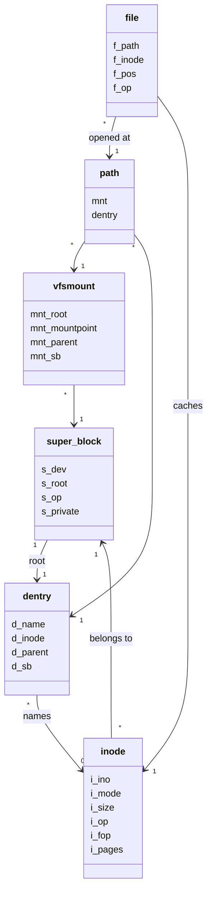
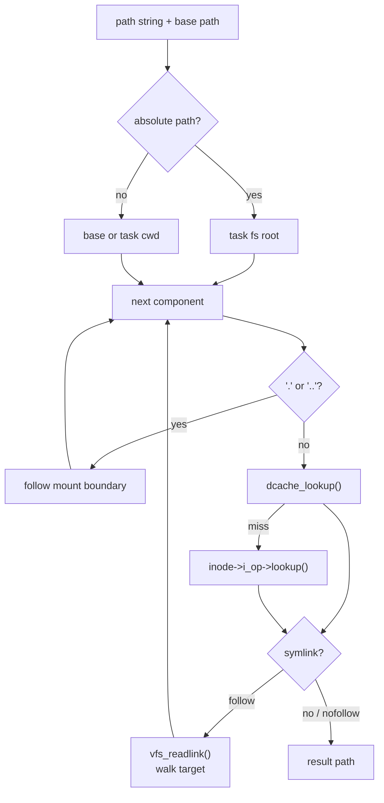

# VFS 架构

VFS 为 syscall、exec、mm file-backed mapping 和具体文件系统之间提供统一对象模型。上层代码操作 `file/path/inode/dentry` 和操作向量；ext2、pipe、console 等具体实现通过 VFS 注册或 file operations 接入。

## 代码边界

主要文件：

- `include/kernel/fs.h`：VFS 公共对象、操作向量、公共 API。
- `include/kernel/vfs.h`：VFS 内部查找、挂载、缓存、chrdev API。
- `fs/vfs/super.c`：文件系统类型和 super block 管理。
- `fs/vfs/inode.c`：inode cache。
- `fs/vfs/dentry.c`：dentry cache。
- `fs/vfs/namei.c`：路径解析。
- `fs/vfs/namei_mutation.c`：create/link/unlink/mkdir/rmdir/rename/mknod。
- `fs/vfs/file.c`：file 对象分配与打开。
- `fs/vfs/read_write.c`：read/write/llseek/readdir/ioctl/poll 路由。
- `fs/vfs/fdtable.c`：每任务 fdtable。
- `fs/vfs/fs_struct.c`：cwd/root/umask。
- `fs/vfs/mount.c`：挂载树。
- `fs/pipe.c`：pipe file operations。

VFS 对外暴露通用文件模型；具体磁盘格式只允许出现在文件系统实现内部。

## 核心对象

`include/kernel/fs.h` 定义 VFS 核心对象。



### super_block

`struct super_block` 表示一个已挂载文件系统实例：

- `s_dev`：后端设备号。
- `s_blocksize`：块大小。
- `s_root`：根 dentry。
- `s_op`：super operations。
- `s_type`：文件系统类型。
- `s_private`：具体文件系统私有数据。
- `s_inodes`：该 super block 下 inode 链表。

### inode

`struct inode` 表示文件元数据：

- `i_ino/mode/uid/gid/nlink/size/blocks/timestamps/rdev`
- `i_sb`
- `i_op`
- `i_fop`
- `i_pages`
- `i_private`

`i_pages` 是文件数据 page cache mapping。VFS/page cache 不知道 ext2 的 direct/indirect block 布局，只通过 `page_mapping_ops` 回调读写。

### dentry

`struct dentry` 表示路径名缓存项：

- `d_name/d_namelen`
- `d_inode`
- `d_parent`
- `d_sb`
- hash/list 节点
- refcount

dentry cache 可以保存 negative dentry，即没有 inode 的查找结果。

### file

`struct file` 表示一次 open 实例：

- `f_op`
- `f_path`
- `f_inode`
- `private_data`
- `f_pos`
- `f_flags`
- `f_mode`
- refcount

fdtable 存储 `struct file *`，多个 fd 可通过 dup 共享同一个 file 和 file position。

### path 和 vfsmount

`struct path` 是 `{ vfsmount *, dentry * }`。挂载边界通过 `vfsmount` 表示：

- `mnt_parent`
- `mnt_mountpoint`
- `mnt_root`
- `mnt_sb`
- `mnt_is_root`

路径解析会在需要时跨越挂载点。

## 操作向量

具体文件系统通过三个主要操作向量接入。

`super_operations`：

```c
int (*read_inode)(struct inode *inode);
int (*write_inode)(struct inode *inode);
int (*datasync_inode)(struct inode *inode);
void (*evict_inode)(struct inode *inode);
int (*sync_fs)(struct super_block *sb);
int (*statfs)(struct super_block *sb, struct statfs64 *buf);
```

`inode_operations`：

```c
lookup, create, symlink, link, unlink, mkdir, rmdir,
readlink, truncate, fallocate, rename
```

`file_operations`：

```c
read, write, llseek, open, readdir, poll, ioctl, release
```

VFS 层负责参数检查、对象查找、fd/path 管理和权限检查；具体文件系统负责磁盘格式和 inode 数据语义。

文件同步入口分为两层：

- `vfs_datasync_file()` 同步该 inode 的脏数据页，然后调用文件系统的
  `datasync_inode` 同步取回这些数据所必需的元数据，用于 `fdatasync`。
  如果文件系统没有实现该 hook，VFS 保守退化为完整 `write_inode`。
- `vfs_sync_file()` 先执行 data sync，再调用 `write_inode` 同步 inode
  元数据，用于 `fsync`。

新增文件系统如果延迟块映射、分配位图、文件大小或其它数据可取回性依赖的
元数据，必须实现 `datasync_inode`；否则 `fdatasync` 会按 `fsync` 风格写回
inode metadata，优先保证正确性而不是 data-only 优化。

## 文件系统注册和 root 挂载

文件系统类型：

```c
struct file_system_type {
    const char *name;
    int (*probe)(dev_t dev);
    int (*mount)(struct file_system_type *fs_type,
                 dev_t dev, const void *data,
                 struct super_block **out_sb);
    struct file_system_type *next;
};
```

`register_filesystem()` 将类型注册到固定数组 `fs_types[8]`。
`get_filesystem_type(name)` 按名称查找，普通 `mount(2)` 语义必须显式指定
filesystem type。

`probe(dev)` 是可选能力，只用于启动根文件系统自动探测：

- 返回正数表示该块设备匹配此文件系统类型。
- 返回 0 表示明确不匹配。
- 返回负 errno 表示 I/O、格式损坏或已识别但不支持的 hard error。

`mount()` 在选定文件系统类型后创建 `super_block` 和 root dentry。成功返回
0 并填充 `out_sb`；失败返回负 errno，不把不同失败压扁成 NULL。

`vfs_init()` 初始化：

- inode cache
- dentry cache
- 文件系统类型数组

`filesystems_init()` 在 VFS 初始化后注册编译进内核的 filesystem type。
`vfs_mount_root(dev)` 由启动路径调用，负责：

1. 确认 root block device 已注册。
2. 遍历带 `probe` hook 的 filesystem type。
3. 要求恰好一个类型匹配；无匹配返回 `-ENODEV`，多重匹配返回 `-EINVAL`。
4. 调用匹配类型的 `mount()`。
5. 把返回的 superblock root dentry 安装成 VFS root mount。

启动期 root mount 失败是 fatal。非 root 的 `vfs_mount(source, target, type,
...)` 不做自动探测，仍按显式 `type` 查找 filesystem type。

当前非 root `mount(2)` 模型故意很小：

- 全局单 mount namespace，没有 per-task mount namespace。
- source 必须解析为 block device，target 必须解析为目录。
- filesystem type 必须显式指定；当前可用动态挂载类型是 `ext2`。
- `flags` 必须为 0；bind、remount、move、propagation、read-only、lazytime
  等 Linux mount flag 都返回 `-EINVAL`。
- target 已经是 mountpoint 时返回 `-EBUSY`。
- `data` 当前不解释，由具体 filesystem mount hook 自行决定是否使用。

`vfs_umount(target, flags)` 也只支持 `flags == 0`。target 必须解析到 mounted
root；root mount 和仍被 file/cwd/dirfd 等 path 引用的 mount 返回 `-EBUSY`。
lazy detach、force umount、expiry 和 no-follow 语义尚未实现。

## 路径解析

路径解析主入口：



```c
int path_lookupat_path(const struct path *base,
                       const char *path,
                       uint32_t flags,
                       struct path *res);
int path_parent_lookupat_path(const struct path *base,
                              const char *path,
                              char *name,
                              size_t *namelen,
                              struct path *res);
```

相对路径从 base 或当前任务 `fs_struct.cwd` 开始；绝对路径从当前任务 root 开始。

解析规则：

- 连续 `/` 被跳过。
- `.` 跳过。
- `..` 通过 dentry parent 回退，并处理挂载边界。
- 中间分量必须是目录。
- 中间 symlink 总是跟随。
- 末端 symlink 在未设置 `LOOKUP_NOFOLLOW` 时跟随。
- symlink 跟随深度限制为 `MAXSYMLINKS=8`。
- 查找单个分量先查 dcache，miss 时调用父 inode 的 `i_op->lookup`。

路径长度上限 `VFS_PATH_MAX=4096`，单个名字上限 `VFS_NAME_MAX=255`。

## dentry 和 inode cache

inode cache 通过 `iget(sb, ino)` 获取 inode：

- 命中已有 inode 时增加引用。
- miss 时分配 inode，并调用 `sb->s_op->read_inode()` 填充。
- `iput()` 引用降为 0 时可触发 evict。

dentry cache 通过 parent/name 查找：

- `dcache_lookup()`
- `dentry_alloc()`
- `dcache_insert()`
- `dcache_invalidate()`
- `dcache_move()`

当前 cache 主要保证对象复用和引用管理，不是完整的内存回收型 dcache/icache。

## fdtable

每个任务通过 `task->resources.files` 持有 fdtable。常量：

```c
#define NR_OPEN 32
```

标准 fd：

```c
#define KERN_STDIN  0
#define KERN_STDOUT 1
#define KERN_STDERR 2
```

syscall 层通过 fdtable helper 将 fd 转为 `struct file *`。dup/dup3/fcntl/close/openat 都围绕 fdtable 操作。

`struct file` 自身带 refcount，fd 复制共享 file 对象，close 只释放当前 fd 引用。

## read/write 路由

公共 API：

```c
ssize_t vfs_read(struct file *file, char *buf, size_t count);
ssize_t vfs_write(struct file *file, const char *buf, size_t count);
ssize_t vfs_read_pos(struct file *file, char *buf, size_t count, loff_t *pos);
ssize_t vfs_write_pos(struct file *file, const char *buf, size_t count,
                      loff_t *pos);
loff_t vfs_llseek(struct file *file, loff_t offset, int whence);
int vfs_readdir(struct file *file, void *ctx, filldir_t filldir);
```

VFS 检查 file mode 和 fop 是否存在，再调用具体 fop。普通 read/write 会推进 `file->f_pos`；pread/pwrite 类路径使用显式 `pos`。

## 变更操作

VFS mutation API 位于 `include/kernel/vfs.h`：

```c
int vfs_create_at_path(...);
int vfs_symlink_at_path(...);
int vfs_link_at_path(...);
int vfs_mkdir_at_path(...);
int vfs_unlink_at_path(...);
int vfs_rename_at_path(...);
int vfs_mknod_at_path(...);
int vfs_inode_truncate(...);
int vfs_fallocate_file(...);
```

mutation 路径负责：

- 找父目录。
- 检查目标是否存在或不存在。
- 调用具体 inode operation。
- 更新 dentry cache。
- 更新 inode 时间戳和链接数。

具体文件系统负责磁盘目录项、inode 分配、块分配和同步。

## 权限模型

`vfs_inode_permission(inode, mask)` 使用 inode mode、uid/gid 和当前 task uid/gid 做简化权限判断。mask 包含：

```c
VFS_MAY_EXEC
VFS_MAY_WRITE
VFS_MAY_READ
```

root uid 具有特殊权限。当前模型足以支撑 busybox 风格用户态，但不是完整 Linux LSM/ACL 权限体系。

## 字符设备和 console

VFS 提供字符设备注册：

```c
int vfs_register_chrdev(dev_t dev,
                        const struct file_operations *fops);
const struct file_operations *vfs_chrdev_fops(dev_t dev);
```

`console_chrdev_init()` 注册 `/dev/console` 使用的 file operations。ext2 中设备特殊文件的 `i_rdev` 通过 VFS 找到对应字符设备 fops。

terminal/tty 行为在 `kernel/tty.c` 和 console driver 中实现，VFS 只负责把 open/read/write/ioctl 路由到 file operations。当前 `/dev/console` 是 single-console 模型：console fops 支持 termios、winsize、controlling tty、foreground process group 和 session id 相关 ioctl；完整 pty、serial、后台读写、orphaned process group 和 hangup 语义仍不属于 VFS。

## poll

VFS poll 通过通用 wait session 暴露 readiness condition：

```c
int vfs_poll(struct file *file, uint32_t events,
             struct wait_session *session);
```

file operation 的 `poll()` 返回当前 readiness，并通过 wait session 登记
等待 channel；watch 错误使用负 errno 传播。ppoll/pselect 在进入
`wait_for()` 前 pin 稳定 file snapshot。epoll 使用 eventpoll 私有锁、
item/file snapshot 和 mutation generation；generation 变化只触发 adapter
内部重建，不直接形成用户可见 event。

## 设计约束

- 上层代码不应绕过 VFS 直接调用 ext2 私有函数。
- VFS 不应了解 ext2 direct/indirect block 布局。
- path 引用必须用 `path_get()`/`path_put()` 成对维护。
- fdtable 只拥有 file 引用，不拥有 inode/dentry 的生命周期细节。
- 字符设备通过 chrdev registry 接入，不应硬编码到 ext2 或 syscall。
